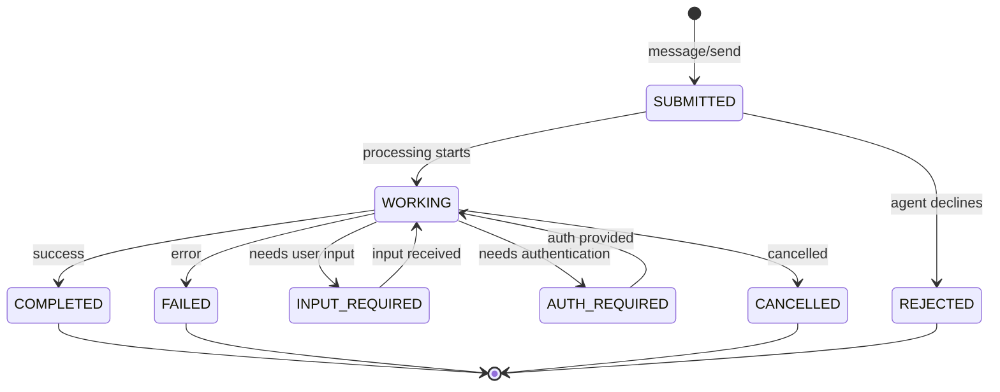
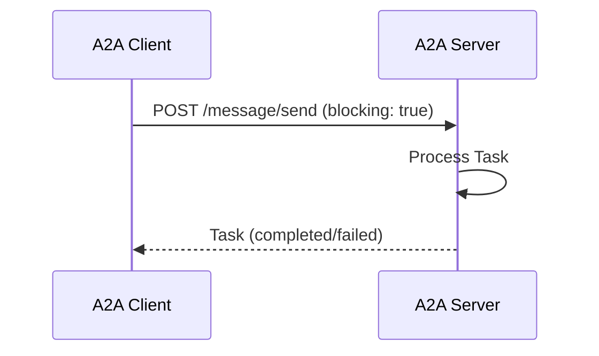
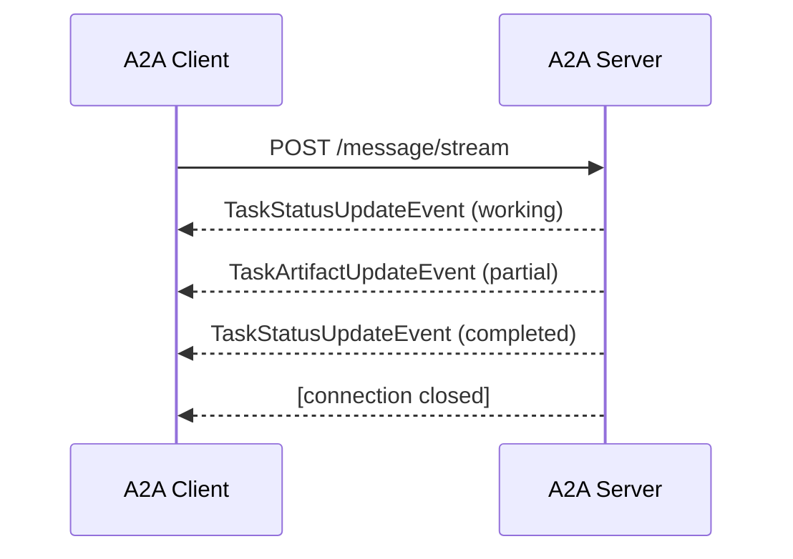
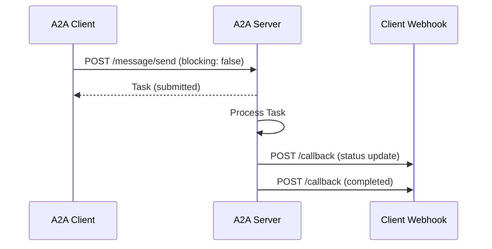
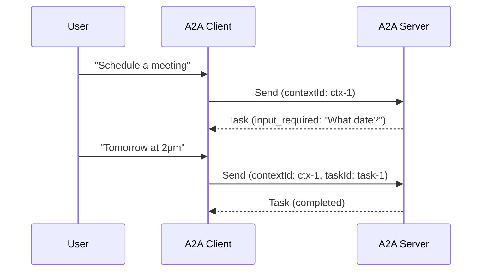
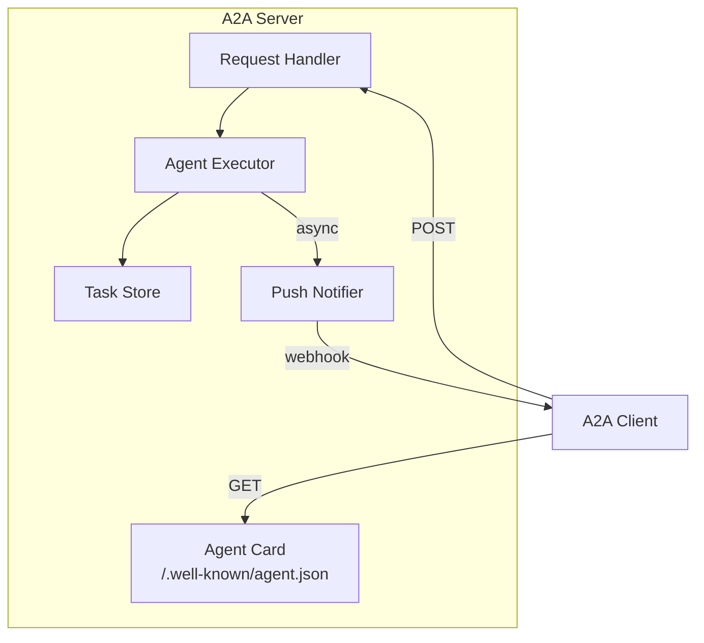
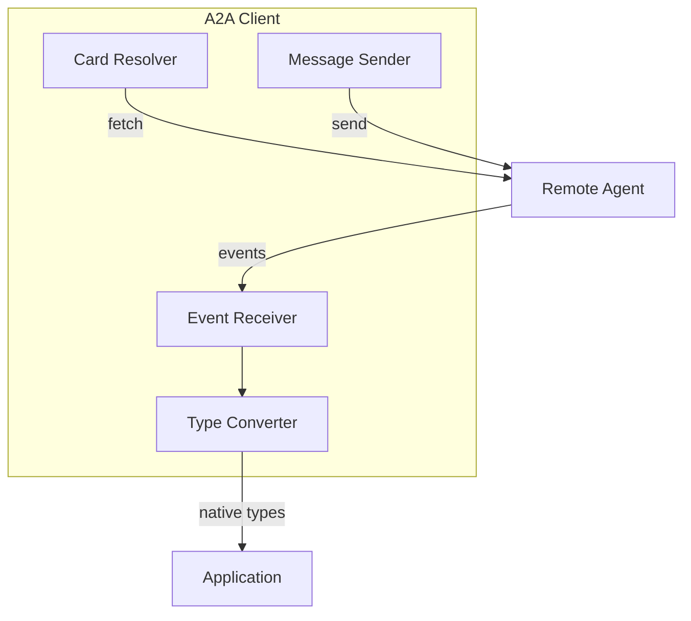
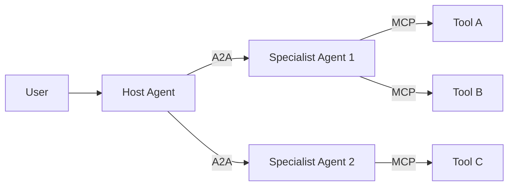

# A2A (Agent-to-Agent) Protocol Deep Dive

## Executive Summary

The Agent2Agent (A2A) Protocol is an open standard developed by Google and now maintained by the Linux Foundation. It enables AI agents built on different frameworks to communicate and collaborate effectively - **as agents, not just as tools**. A2A provides a common language for agent interoperability without requiring agents to expose their internal state, memory, or tool implementations.

**Key Differentiator from MCP**: While Model Context Protocol (MCP) handles agent-to-tool communication, A2A handles agent-to-agent communication. They are complementary protocols.

---

## 1. Core Concepts & Terminology

### 1.1 Primary Entities

| Entity | Description |
|--------|-------------|
| **A2A Client** | An application or agent that initiates requests to an A2A Server on behalf of a user or another system |
| **A2A Server (Remote Agent)** | An agent or agentic system that exposes an A2A-compliant endpoint, processing tasks and providing responses |
| **Agent Card** | A JSON metadata document published by an A2A Server, describing its identity, capabilities, skills, service endpoint, and authentication requirements |
| **Task** | The fundamental unit of work in A2A with a unique ID and defined lifecycle states |
| **Message** | A single communication turn containing either "user" or "agent" role content |
| **Part** | The smallest unit of content within a message (TextPart, FilePart, DataPart) |
| **Artifact** | Output generated by an agent during task processing |

### 1.2 Design Philosophy

A2A is designed around these principles:
- **Opacity**: Agents collaborate based on declared capabilities without sharing internal thoughts, plans, or tool implementations
- **Interoperability**: Works across different frameworks, languages, and vendors
- **Enterprise-Ready**: Built with security, authentication, and observability in mind
- **Flexibility**: Supports sync, async, and streaming communication patterns

---

## 2. Agent Card Structure

The Agent Card is the fundamental discovery mechanism in A2A. It's a JSON document published at `/.well-known/agent.json`.

### 2.1 Complete Agent Card Schema

```json
{
  "name": "Agent Name",
  "description": "Human-readable description of the agent's purpose",
  "url": "https://agent-endpoint.example.com/",
  "version": "1.0.0",
  "protocolVersion": "0.3",

  "capabilities": {
    "streaming": true,
    "pushNotifications": true
  },

  "defaultInputModes": ["text", "text/plain"],
  "defaultOutputModes": ["text", "application/json"],

  "skills": [
    {
      "id": "skill_unique_id",
      "name": "Skill Display Name",
      "description": "Detailed description of what this skill does",
      "tags": ["category", "capability", "domain"],
      "examples": [
        "Example query 1",
        "Example query 2"
      ]
    }
  ],

  "securitySchemes": {
    "apiKey": {
      "type": "apiKey",
      "in": "header",
      "name": "X-API-Key"
    },
    "oauth2": {
      "type": "oauth2",
      "flows": {
        "clientCredentials": {
          "tokenUrl": "https://auth.example.com/token",
          "scopes": {
            "read": "Read access",
            "write": "Write access"
          }
        }
      }
    }
  },

  "supportsExtendedAgentCard": true
}
```

### 2.2 Key Agent Card Fields

| Field | Required | Description |
|-------|----------|-------------|
| `name` | Yes | Unique identifier for the agent |
| `description` | Yes | Human-readable purpose description |
| `url` | Yes | Base HTTP endpoint where agent is accessible |
| `version` | Yes | Agent version (semantic versioning recommended) |
| `protocolVersion` | Yes | A2A protocol version supported |
| `capabilities` | No | Features supported (streaming, pushNotifications) |
| `skills` | No | Array of AgentSkill objects describing capabilities |
| `securitySchemes` | No | Authentication requirements (OpenAPI-compatible) |
| `defaultInputModes` | No | Supported input content types |
| `defaultOutputModes` | No | Supported output content types |

### 2.3 Agent Card Signing

For enhanced security, Agent Cards can be signed:
- Uses standardized canonicalization
- Supports multiple signature formats
- Enables authenticity verification

---

## 3. Message Format & Schemas

### 3.1 Message Structure

```json
{
  "role": "user",
  "messageId": "unique-message-uuid",
  "taskId": "task-uuid",
  "contextId": "context-uuid",
  "referenceTaskIds": ["related-task-1", "related-task-2"],
  "parts": [
    {
      "type": "text",
      "text": "Message content here"
    }
  ],
  "metadata": {
    "custom_key": "custom_value"
  }
}
```

### 3.2 Part Types

#### TextPart
```json
{
  "type": "text",
  "text": "Plain text content"
}
```

#### FilePart (with URI)
```json
{
  "type": "file",
  "file": {
    "uri": "https://example.com/file.pdf",
    "mimeType": "application/pdf"
  }
}
```

#### FilePart (with Bytes)
```json
{
  "type": "file",
  "file": {
    "bytes": "base64-encoded-content",
    "mimeType": "image/png"
  }
}
```

#### DataPart (Structured JSON)
```json
{
  "type": "data",
  "data": {
    "structured": "json_content",
    "schema": "optional_reference"
  }
}
```

### 3.3 Request/Response Protocol

#### SendMessageRequest
```json
{
  "jsonrpc": "2.0",
  "id": "request-uuid",
  "method": "message/send",
  "params": {
    "message": {
      "role": "user",
      "messageId": "msg-uuid",
      "parts": [...]
    },
    "configuration": {
      "blocking": true,
      "historyLength": 10
    }
  }
}
```

#### SendMessageResponse (Success)
```json
{
  "jsonrpc": "2.0",
  "id": "request-uuid",
  "result": {
    "id": "task-uuid",
    "contextId": "context-uuid",
    "status": {
      "state": "completed"
    },
    "artifacts": [
      {
        "name": "result",
        "parts": [
          {"type": "text", "text": "Agent response"}
        ]
      }
    ],
    "history": [...]
  }
}
```

---

## 4. Task Lifecycle & States

### 4.1 Task State Machine



### 4.2 Task States Explained

| State | Terminal | Description |
|-------|----------|-------------|
| `SUBMITTED` | No | Task acknowledged and queued for processing |
| `WORKING` | No | Task is actively being processed |
| `INPUT_REQUIRED` | No (interrupted) | Task paused, awaiting client input |
| `AUTH_REQUIRED` | No | Task requires out-of-band authentication |
| `COMPLETED` | **Yes** | Task finished successfully |
| `FAILED` | **Yes** | Task finished with error |
| `CANCELLED` | **Yes** | Task stopped before completion |
| `REJECTED` | **Yes** | Agent declined to execute the task |

### 4.3 Task Object Structure

```json
{
  "id": "task-uuid",
  "contextId": "context-uuid",
  "status": {
    "state": "working",
    "message": {
      "role": "agent",
      "parts": [{"type": "text", "text": "Processing..."}]
    },
    "timestamp": "2025-12-22T10:30:00Z"
  },
  "artifacts": [],
  "history": [
    {
      "role": "user",
      "parts": [{"type": "text", "text": "Original request"}]
    }
  ],
  "metadata": {}
}
```

---

## 5. Communication Patterns

### 5.1 Synchronous Request/Response



**Configuration:**
```json
{
  "configuration": {
    "blocking": true
  }
}
```

### 5.2 Asynchronous with Streaming (SSE)



**Event Types:**
- `TaskStatusUpdateEvent` - State changes
- `TaskArtifactUpdateEvent` - Partial artifacts during processing

### 5.3 Asynchronous with Push Notifications



**Push Notification Registration:**
```json
{
  "configuration": {
    "blocking": false,
    "pushNotification": {
      "url": "https://client.example.com/a2a-callback",
      "authentication": {
        "type": "bearer",
        "token": "callback-auth-token"
      }
    }
  }
}
```

### 5.4 Multi-Turn Conversations

Use shared `contextId` and `taskId` for conversational continuity:



---

## 6. Authentication Mechanisms

### 6.1 Supported Security Schemes

| Scheme | Description |
|--------|-------------|
| `apiKey` | API key in header or query parameter |
| `http` (basic) | HTTP Basic authentication |
| `http` (bearer) | Bearer token authentication |
| `oauth2` | OAuth 2.0 flows (authorization code, client credentials, etc.) |
| `openIdConnect` | OpenID Connect for identity |
| `mutualTLS` | Certificate-based mutual authentication |

### 6.2 Security Scheme Examples

#### API Key
```json
{
  "securitySchemes": {
    "apiKey": {
      "type": "apiKey",
      "in": "header",
      "name": "X-API-Key"
    }
  }
}
```

#### OAuth 2.0 Client Credentials
```json
{
  "securitySchemes": {
    "oauth2": {
      "type": "oauth2",
      "flows": {
        "clientCredentials": {
          "tokenUrl": "https://auth.example.com/oauth/token",
          "scopes": {
            "agent:read": "Read agent data",
            "agent:execute": "Execute agent tasks"
          }
        }
      }
    }
  }
}
```

### 6.3 Extended Agent Cards

For sensitive capability information:
1. Basic Agent Card available at `/.well-known/agent.json`
2. Extended Agent Card requires authentication
3. Set `supportsExtendedAgentCard: true` in basic card

---

## 7. Error Handling

### 7.1 A2A-Specific Errors

| Error | Description |
|-------|-------------|
| `TaskNotFoundError` | Referenced task doesn't exist |
| `PushNotificationNotSupportedError` | Agent doesn't support push notifications |
| `VersionNotSupportedError` | Requested protocol version not supported |
| `ContentTypeNotSupportedError` | Input/output mode not supported |
| `UnsupportedOperationError` | Operation not supported by agent |

### 7.2 HTTP Error Mapping

| HTTP Status | A2A Error Category |
|-------------|-------------------|
| `400` | Validation errors (invalid parameters) |
| `401` | Authentication errors |
| `403` | Authorization errors |
| `404` | Resource not found |
| `405` | Method not allowed |
| `415` | Content type not supported |
| `429` | Rate limit exceeded |
| `500` | Internal server error |
| `503` | Service unavailable (with retry guidance) |

### 7.3 Error Response Format

```json
{
  "jsonrpc": "2.0",
  "id": "request-uuid",
  "error": {
    "code": -32600,
    "message": "Task not found",
    "data": {
      "taskId": "invalid-task-id"
    }
  }
}
```

---

## 8. Protocol Bindings

### 8.1 JSON-RPC 2.0 over HTTP (Primary)

**Endpoint:** `POST /`

**Methods:**
- `message/send` - Send a message to the agent
- `message/stream` - Send with streaming response (SSE)
- `tasks/get` - Get task status
- `tasks/cancel` - Cancel a task
- `tasks/resubscribe` - Resubscribe to task events

### 8.2 gRPC Binding

High-performance binary protocol for:
- Low-latency requirements
- High-throughput scenarios
- Type-safe contracts via protobuf

### 8.3 HTTP+JSON/REST Binding

RESTful patterns for simpler integration:
- `POST /messages` - Send message
- `GET /tasks/{id}` - Get task
- `DELETE /tasks/{id}` - Cancel task

---

## 9. Service Parameters

### 9.1 Protocol Headers

| Header | Purpose |
|--------|---------|
| `A2A-Version` | Protocol version (e.g., "0.3") |
| `A2A-Extensions` | Comma-separated extension URIs |

### 9.2 Configuration Parameters

| Parameter | Default | Description |
|-----------|---------|-------------|
| `blocking` | false | Wait for task completion |
| `historyLength` | unset | Number of history messages to return |
| `timeout` | varies | Request timeout in milliseconds |

---

## 10. Implementation Architecture

### 10.1 Server Implementation Pattern



### 10.2 Client Implementation Pattern



---

## 11. Framework Integration Examples

### 11.1 Python SDK Usage

```python
from a2a.client import A2AClient, A2ACardResolver
from a2a.types import Message, Part, TextPart, Role, SendMessageRequest
import httpx
import uuid

async def main():
    async with httpx.AsyncClient() as http_client:
        # Discover agent
        resolver = A2ACardResolver(http_client, "https://agent.example.com")
        card = await resolver.get_agent_card()

        # Create client
        client = A2AClient(http_client, card)

        # Send message
        message = Message(
            role=Role.user,
            messageId=str(uuid.uuid4()),
            parts=[Part(root=TextPart(text="Hello, agent!"))]
        )

        request = SendMessageRequest(
            id=str(uuid.uuid4()),
            params=MessageSendParams(message=message)
        )

        response = await client.send_message(request)
        print(response)
```

### 11.2 Server Implementation (Python)

```python
from a2a.server.apps import A2AStarletteApplication
from a2a.server.request_handlers import DefaultRequestHandler
from a2a.server.tasks import InMemoryTaskStore
from a2a.server.agent_execution import AgentExecutor
from a2a.types import AgentCard, AgentSkill, AgentCapabilities

class MyAgentExecutor(AgentExecutor):
    async def execute(self, context, event_queue):
        # Process the request
        user_input = context.get_user_input()
        result = await self.process(user_input)

        # Return result
        event_queue.enqueue_event(
            new_agent_text_message(result)
        )

    async def cancel(self, context, event_queue):
        pass

# Create agent card
card = AgentCard(
    name="My Agent",
    description="Does useful things",
    url="http://localhost:8000/",
    version="1.0.0",
    capabilities=AgentCapabilities(streaming=True),
    skills=[
        AgentSkill(
            id="my_skill",
            name="My Skill",
            description="Does something useful"
        )
    ]
)

# Create server
handler = DefaultRequestHandler(
    agent_executor=MyAgentExecutor(),
    task_store=InMemoryTaskStore()
)

server = A2AStarletteApplication(
    http_handler=handler,
    agent_card=card
)

# Run with uvicorn
import uvicorn
uvicorn.run(server.build(), host="0.0.0.0", port=8000)
```

---

## 12. A2A vs MCP Comparison

| Aspect | A2A | MCP |
|--------|-----|-----|
| **Purpose** | Agent-to-agent communication | Agent-to-tool communication |
| **Participants** | Autonomous agents | Agent + tools/resources |
| **Communication** | Bidirectional, conversational | Request-response, tool calls |
| **State** | Task-based with lifecycle | Stateless tool invocations |
| **Discovery** | Agent Cards at well-known URL | Tool manifests |
| **I/O** | Unstructured (natural language) | Structured (schemas) |
| **Use Case** | Multi-agent orchestration | Extending agent capabilities |

### Complementary Usage



---

## 13. Official Resources

- **Specification**: https://a2a-protocol.org/latest/specification/
- **GitHub (Protocol)**: https://github.com/a2aproject/A2A
- **Python SDK**: https://github.com/a2aproject/a2a-python
- **Go SDK**: https://github.com/a2aproject/a2a-go
- **JS SDK**: https://github.com/a2aproject/a2a-js
- **Java SDK**: https://github.com/a2aproject/a2a-java
- **.NET SDK**: https://github.com/a2aproject/a2a-dotnet
- **Samples**: https://github.com/a2aproject/a2a-samples
- **Google ADK Docs**: https://google.github.io/adk-docs/a2a/intro/

---

## 14. Key Takeaways for Integration

1. **Agent Cards are the discovery mechanism** - Publish at `/.well-known/agent.json`
2. **Tasks are the work units** - Every interaction creates/updates a task
3. **Messages contain Parts** - Support multiple modalities (text, files, data)
4. **Three communication patterns** - Sync, streaming, push notifications
5. **Enterprise-ready authentication** - OpenAPI-compatible security schemes
6. **Complements MCP** - Use A2A for agent-to-agent, MCP for agent-to-tool
7. **Framework-agnostic** - Works with any agent framework (ADK, LangGraph, CrewAI, etc.)
