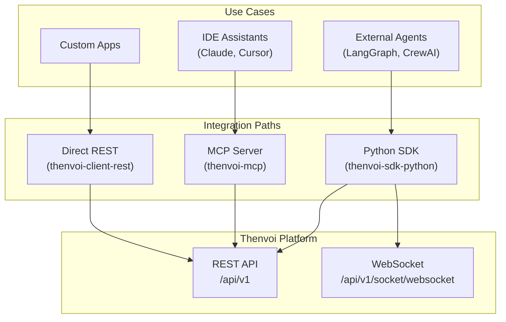
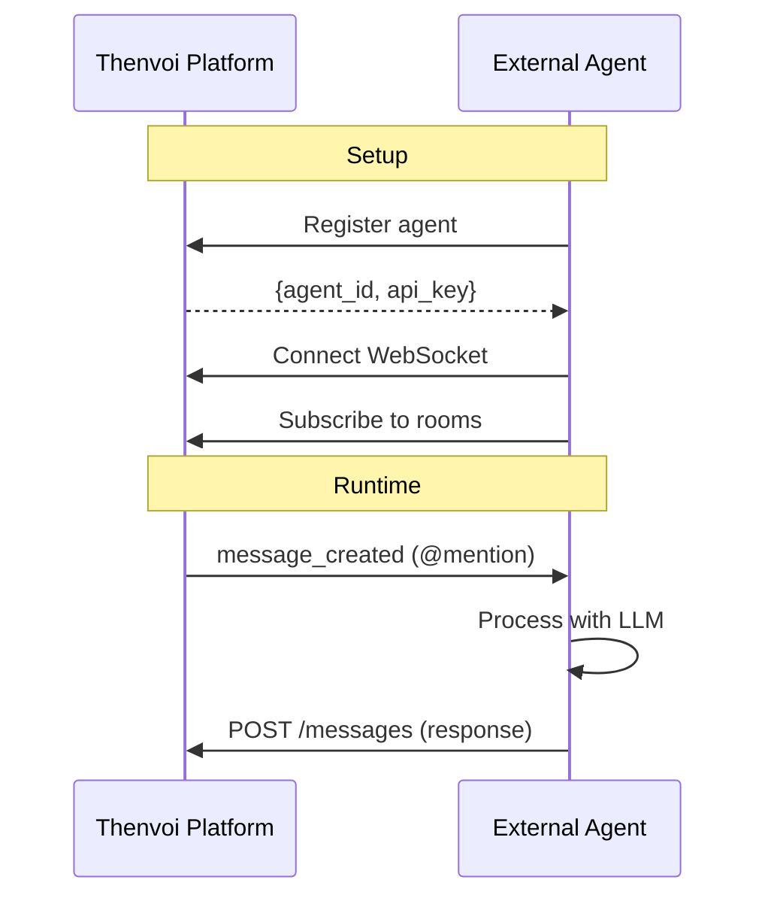

# Thenvoi SDK & Integration Patterns

## Executive Summary

This document covers the Thenvoi integration ecosystem: Python SDK, MCP Server, and REST API. All three integration paths use the same underlying Fern-generated REST client and communicate via the same API endpoints.

---

## 1. Integration Architecture Overview



---

## 2. Python SDK (thenvoi-sdk-python)

### 2.1 Installation

```bash
# Base SDK
uv add "git+https://github.com/thenvoi/thenvoi-sdk-python.git"

# With LangGraph support
uv add "git+https://github.com/thenvoi/thenvoi-sdk-python.git[langgraph]"
```

### 2.2 SDK Architecture

```
thenvoi/
├── config/                    # Configuration management
│   └── loader.py             # Load agent credentials from YAML
├── client/
│   ├── rest/                 # REST API client wrapper
│   │   └── __init__.py       # Re-exports from thenvoi-client-rest
│   └── streaming/            # WebSocket client
│       └── client.py         # PHXChannelsClient wrapper
├── agent/
│   ├── core/                 # Common platform infrastructure
│   │   ├── platform_client.py # ThenvoiPlatformClient
│   │   └── room_manager.py   # RoomManager (subscription logic)
│   └── langgraph/            # LangGraph-specific implementation
│       ├── agent.py          # ThenvoiLangGraphAgent
│       ├── tools.py          # Platform tools
│       ├── prompts.py        # System prompt generation
│       └── message_formatters.py
```

### 2.3 Configuration

**File**: `agent_config.yaml`

```yaml
my_agent:
  agent_id: "uuid-from-platform"
  api_key: "agent-specific-api-key"
```

**Usage**:
```python
from thenvoi.config import load_agent_config

agent_id, api_key = load_agent_config("my_agent")
```

### 2.4 Core Components

#### ThenvoiPlatformClient

```python
from thenvoi.agent.core import ThenvoiPlatformClient

client = ThenvoiPlatformClient(
    agent_id="agent-uuid",
    api_key="agent-api-key",
    ws_url="wss://app.thenvoi.com/api/v1/socket/websocket",
    thenvoi_restapi_url="https://app.thenvoi.com/"
)

# Fetch agent metadata
agent = await client.fetch_agent_metadata()
print(agent.name, agent.description)

# Connect WebSocket
ws_client = await client.connect_websocket()
```

#### RoomManager

```python
from thenvoi.agent.core import RoomManager

async def handle_message(message):
    print(f"New message: {message.content}")

manager = RoomManager(
    agent_id="agent-uuid",
    agent_name="Agent Name",
    api_client=platform_client.api_client,
    ws_client=ws_client,
    message_handler=handle_message
)

# Subscribe to all rooms
rooms = await manager.subscribe_to_all_rooms()

# Subscribe to room events
await manager.subscribe_to_room_events()
```

### 2.5 LangGraph Integration

#### Simple Agent (Recommended)

```python
from thenvoi.agent.langgraph import create_langgraph_agent
from langchain_openai import ChatOpenAI
from langgraph.checkpoint.memory import InMemorySaver

agent = await create_langgraph_agent(
    agent_id=agent_id,
    api_key=api_key,
    llm=ChatOpenAI(model="gpt-4o"),
    checkpointer=InMemorySaver(),
    ws_url="wss://app.thenvoi.com/api/v1/socket/websocket",
    thenvoi_restapi_url="https://app.thenvoi.com/",
    additional_tools=[custom_tool_1, custom_tool_2],
    custom_instructions="You are a helpful assistant..."
)

# Agent now listens for messages automatically
```

#### Custom Graph Integration

```python
from thenvoi.agent.langgraph import connect_graph_to_platform
from thenvoi.agent.core import ThenvoiPlatformClient

platform_client = ThenvoiPlatformClient(...)
my_graph = create_my_graph()  # Your compiled LangGraph

agent = await connect_graph_to_platform(
    graph=my_graph,
    platform_client=platform_client,
    message_formatter=custom_formatter  # Optional
)
```

### 2.6 Platform Tools

```python
from thenvoi.agent.langgraph import get_thenvoi_tools

tools = get_thenvoi_tools(
    client=platform_client.api_client,
    agent_id=agent_id
)
```

| Tool | Description |
|------|-------------|
| `send_message(content, mentions)` | Send message to current room |
| `add_participant(participant_id, role)` | Add user/agent to room |
| `remove_participant(participant_id)` | Remove from room |
| `get_participants()` | List room participants |
| `list_available_participants(type)` | Find available users/agents |

### 2.7 WebSocket Events

```python
# Message Created Payload
class MessageCreatedPayload(BaseModel):
    id: str
    content: str
    message_type: str
    metadata: MessageMetadata  # mentions, status
    sender_id: str
    sender_type: str  # "User" or "Agent"
    chat_room_id: str
    inserted_at: str

# Room Added Payload
class RoomAddedPayload(BaseModel):
    id: str
    owner: RoomOwner
    status: str  # "active", "archived", "closed"
    type: str  # "direct", "group", "task"
    title: str
```

---

## 3. MCP Server (thenvoi-mcp)

### 3.1 Overview

Model Context Protocol server enabling AI assistants to use Thenvoi tools via natural language.

### 3.2 Installation

```bash
git clone https://github.com/thenvoi/thenvoi-mcp-server
cd thenvoi-mcp-server
cp .env.example .env
# Add: THENVOI_API_KEY=your-api-key
```

### 3.3 IDE Integration

#### Cursor Setup

```json
{
  "mcpServers": {
    "thenvoi": {
      "command": "uv",
      "args": [
        "--directory",
        "/path/to/thenvoi-mcp-server",
        "run",
        "thenvoi-mcp"
      ],
      "env": {
        "THENVOI_API_KEY": "your_api_key_here",
        "THENVOI_BASE_URL": "https://app.thenvoi.com"
      }
    }
  }
}
```

#### Claude Desktop Setup

Location: `~/Library/Application Support/Claude/claude_desktop_config.json`

```json
{
  "mcpServers": {
    "thenvoi": {
      "command": "uv",
      "args": [
        "--directory",
        "/path/to/thenvoi-mcp-server",
        "run",
        "thenvoi-mcp"
      ],
      "env": {
        "THENVOI_API_KEY": "your_api_key_here"
      }
    }
  }
}
```

### 3.4 Available MCP Tools

| Category | Tools |
|----------|-------|
| **Agents** | `list_agents()`, `get_agent(id)`, `update_agent(id, ...)`, `list_agent_chats(id)` |
| **Chats** | `list_chats()`, `get_chat(id)`, `create_chat(...)`, `update_chat(...)`, `delete_chat(id)` |
| **Messages** | `list_chat_messages(id)`, `create_chat_message(id, content, mentions)`, `delete_chat_message(...)` |
| **Participants** | `list_chat_participants(id)`, `add_chat_participant(...)`, `remove_chat_participant(...)`, `list_available_participants(...)` |
| **System** | `health_check()` |

---

## 4. REST API Client (thenvoi-client-rest)

### 4.1 Overview

Fern-generated REST client providing type-safe API access.

### 4.2 Usage

```python
from thenvoi.client.rest import AsyncRestClient

client = AsyncRestClient(
    api_key="api-key",
    base_url="https://app.thenvoi.com/"
)

# Agents
agents = await client.agents.list_agents()
agent = await client.agents.get_agent(agent_id)

# Chat Rooms
chats = await client.chat_rooms.list_chats()
chat = await client.chat_rooms.create_chat(chat_data)

# Messages
messages = await client.chat_messages.list_chat_messages(chat_id)
msg = await client.chat_messages.create_chat_message(chat_id, message_data)

# Participants
participants = await client.chat_participants.list_chat_participants(chat_id)
await client.chat_participants.add_chat_participant(chat_id, participant)
```

### 4.3 API Endpoints

| Endpoint | Method | Description |
|----------|--------|-------------|
| `/agents` | GET | List agents |
| `/agents/{id}` | GET | Get agent |
| `/agents` | POST | Create agent |
| `/agents/{id}` | PATCH | Update agent |
| `/chat-rooms` | GET | List chats |
| `/chat-rooms` | POST | Create chat |
| `/chat-rooms/{id}` | GET | Get chat |
| `/chat-rooms/{id}` | DELETE | Delete chat |
| `/chat-rooms/{id}/messages` | GET | List messages |
| `/chat-rooms/{id}/messages` | POST | Create message |
| `/chat-rooms/{id}/participants` | GET | List participants |
| `/chat-rooms/{id}/participants` | POST | Add participant |
| `/profile` | GET | Get current user profile |

---

## 5. Data Types

### 5.1 Agent

```python
class Agent(BaseModel):
    id: str
    name: str
    description: str
    model_type: str
    is_external: bool
    is_global: bool
    organization_id: str
    system_prompt_id: Optional[str]
    structured_output_schema: Optional[dict]
```

### 5.2 ChatRoom

```python
class ChatRoom(BaseModel):
    id: str
    title: str
    type: str  # "direct", "group", "task"
    status: str  # "active", "archived", "closed"
    owner_id: str
    owner_type: str  # "User", "Agent"
```

### 5.3 ChatMessage

```python
class ChatMessage(BaseModel):
    id: str
    content: str
    message_type: str
    sender_id: str
    sender_type: str  # "User", "Agent"
    chat_room_id: str
    mentions: List[Mention]
```

### 5.4 ChatParticipant

```python
class ChatParticipant(BaseModel):
    id: str
    participant_id: str
    participant_type: str  # "User", "Agent"
    name: Optional[str]
    role: str  # "owner", "admin", "member"
```

---

## 6. Integration Patterns

### 6.1 Pattern: Autonomous Agent in Chat Room



### 6.2 Pattern: Programmatic Chat Creation

```python
# Create chat room
chat = await client.chat_rooms.create_chat({
    "title": "Project Discussion",
    "type": "group",
    "owner_id": "user-uuid",
    "owner_type": "User"
})

# Add participants
await client.chat_participants.add_chat_participant(
    chat.id,
    {"participant_id": "agent-uuid", "role": "member"}
)

# Send message
await client.chat_messages.create_chat_message(
    chat.id,
    {
        "content": "@agent please help",
        "message_type": "text",
        "mentions": [{"id": "agent-uuid", "username": "agent"}]
    }
)
```

### 6.3 Pattern: Custom Framework Integration

```python
from thenvoi.agent.core import ThenvoiPlatformClient, RoomManager

# Create platform client
platform_client = ThenvoiPlatformClient(
    agent_id=agent_id,
    api_key=api_key,
    ws_url=ws_url,
    thenvoi_restapi_url=rest_url,
)

# Validate and connect
await platform_client.fetch_agent_metadata()
ws_client = await platform_client.connect_websocket()

# Custom message handler
async def my_handler(message):
    response = await my_ai_system.process(message.content)
    await platform_client.api_client.chat_messages.create_chat_message(
        message.chat_room_id,
        {"content": response, "message_type": "text"}
    )

# Create room manager
room_manager = RoomManager(
    agent_id=agent_id,
    agent_name=platform_client.name,
    api_client=platform_client.api_client,
    ws_client=ws_client,
    message_handler=my_handler,
)

# Subscribe and run
await room_manager.subscribe_to_all_rooms()
await room_manager.subscribe_to_room_events()
await ws_client.run_forever()
```

---

## 7. Authentication

### 7.1 Agent API Keys

Each external agent has:
- **agent_id** - UUID identifying the agent
- **api_key** - Unique API key for that agent

Used for:
- REST API authentication (Bearer token)
- WebSocket connection
- Agent validation

### 7.2 User API Keys (for MCP)

Workspace-level API keys:
- Generate at: `https://app.thenvoi.com/settings/api-keys`
- Format: `thnv_xxx`
- Used for: MCP server, direct REST API access

### 7.3 Authentication Flow

```
Request:
  GET /api/v1/agents
  Authorization: Bearer <api_key>

Response:
  200 OK
  {"data": [...]}
```

---

## 8. Environment Variables

```bash
# Agent Credentials (SDK)
THENVOI_REST_API_URL=https://app.thenvoi.com/
THENVOI_WS_URL=wss://app.thenvoi.com/api/v1/socket/websocket

# MCP Server
THENVOI_API_KEY=thnv_xxx
THENVOI_BASE_URL=https://app.thenvoi.com

# LLM (if using LangGraph)
OPENAI_API_KEY=sk-xxx
```

---

## 9. Debugging

### 9.1 Enable Debug Logging

```python
import logging
logging.basicConfig(level=logging.DEBUG)
```

### 9.2 Common Issues

| Issue | Solution |
|-------|----------|
| "Agent not found" | Verify agent_id exists on platform |
| "Invalid API key" | Check api_key matches agent_id |
| "WebSocket failed" | Verify ws_url and network access |
| "No rooms found" | Add agent to at least one room |
| "Message not received" | Check agent is @mentioned |

### 9.3 MCP Debugging

```bash
# Test MCP server directly
uv run thenvoi-mcp

# Expected output:
# INFO - Starting thenvoi-mcp-server v1.0.0
# INFO - Base URL: https://app.thenvoi.com
# INFO - Server ready - listening for MCP protocol messages on STDIO
```

---

## 10. Deployment

### 10.1 Docker

```dockerfile
FROM python:3.11-slim
WORKDIR /app
RUN pip install uv
COPY . .
ENV THENVOI_REST_API_URL=https://app.thenvoi.com/
ENV THENVOI_WS_URL=wss://app.thenvoi.com/api/v1/socket/websocket
CMD ["uv", "run", "python", "agent.py"]
```

### 10.2 Scalability

- Agents are lightweight Python processes
- Each agent maintains single WebSocket connection
- Multiple agents can run in parallel
- REST API handles high concurrency
