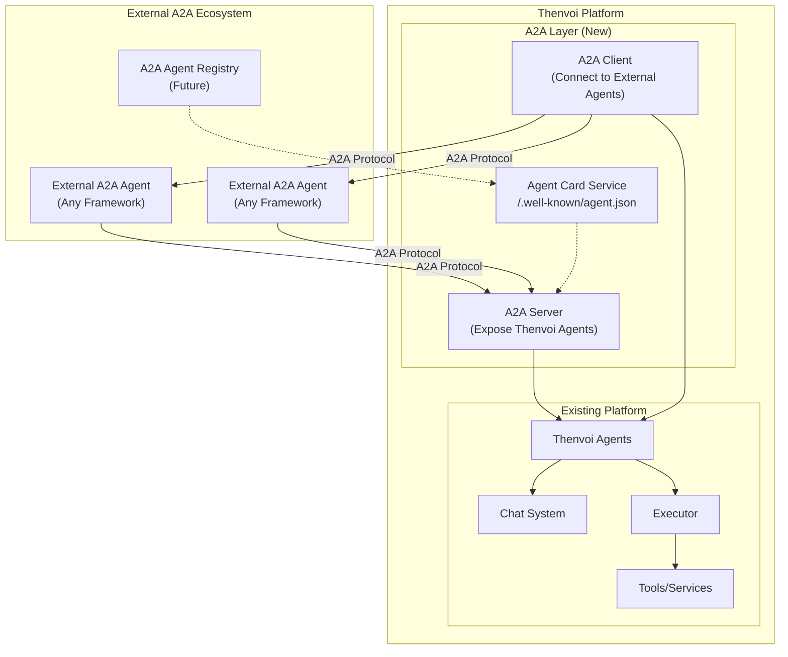
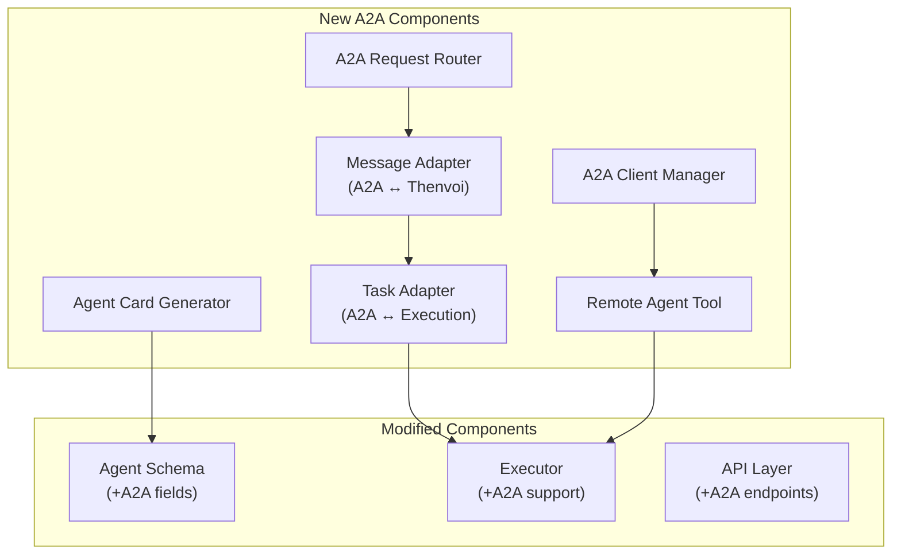

# A2A-Thenvoi Integration Analysis

## Executive Summary

This document analyzes how to integrate the A2A (Agent-to-Agent) protocol with the Thenvoi platform. The integration has two primary goals:

1. **Users with existing A2A integrations can use Thenvoi** - Thenvoi agents expose A2A-compliant endpoints
2. **Thenvoi becomes A2A-compatible by default** - Internal agent communication uses A2A protocol

---

## 1. Integration Architecture Vision

### 1.1 High-Level Architecture



### 1.2 Integration Modes

| Mode | Description | Use Case |
|------|-------------|----------|
| **Server Mode** | Thenvoi agents exposed as A2A servers | External agents call Thenvoi agents |
| **Client Mode** | Thenvoi as A2A client | Thenvoi agents call external A2A agents |
| **Hybrid Mode** | Both server and client | Full bidirectional A2A participation |

---

## 2. Concept Mapping: A2A ↔ Thenvoi

### 2.1 Core Entity Mapping

| A2A Concept | Thenvoi Equivalent | Notes |
|-------------|-------------------|-------|
| **A2A Server** | Thenvoi Agent | Each agent becomes an A2A endpoint |
| **A2A Client** | Platform/SDK | Initiates requests to agents |
| **Agent Card** | Agent + Metadata | Generate from Agent schema |
| **Task** | AgentExecution | Maps to execution lifecycle |
| **Message** | ChatMessage | Role-based messages |
| **Part** | Message content | Text, files, structured data |
| **Artifact** | Execution output | Final results |
| **Skill** | Agent tools/capabilities | Derived from attached tools |

### 2.2 State Mapping

| A2A Task State | Thenvoi Execution Status | Notes |
|----------------|-------------------------|-------|
| `SUBMITTED` | `new` | Task acknowledged |
| `WORKING` | `processing` | Actively processing |
| `INPUT_REQUIRED` | `waiting` | Awaiting input |
| `COMPLETED` | `completed` | Successfully finished |
| `FAILED` | `failed` | Error occurred |
| `CANCELLED` | N/A | Need to add |
| `REJECTED` | N/A | Need to add |

### 2.3 Communication Pattern Mapping

| A2A Pattern | Thenvoi Implementation |
|-------------|----------------------|
| **Sync Request/Response** | Direct execution with blocking |
| **Streaming (SSE)** | Phoenix Channel events |
| **Push Notifications** | WebSocket + Webhooks |
| **Multi-Turn** | Chat threads with contextId |

---

## 3. Integration Components

### 3.1 Component Overview



### 3.2 Agent Card Generator

**Purpose**: Generate A2A Agent Cards from Thenvoi Agent schema

**Input**: Thenvoi Agent
```elixir
%Agent{
  id: "uuid",
  name: "Research Agent",
  description: "Performs deep research on topics",
  model_type: "gpt-4o",
  tools: [tool1, tool2],
  ...
}
```

**Output**: A2A Agent Card
```json
{
  "name": "Research Agent",
  "description": "Performs deep research on topics",
  "url": "https://app.thenvoi.com/a2a/agents/{agent_id}/",
  "version": "1.0.0",
  "protocolVersion": "0.3",
  "capabilities": {
    "streaming": true,
    "pushNotifications": true
  },
  "skills": [
    {
      "id": "tool1_id",
      "name": "Tool 1 Name",
      "description": "Tool 1 description",
      "tags": ["category"]
    }
  ],
  "securitySchemes": {
    "apiKey": {
      "type": "apiKey",
      "in": "header",
      "name": "Authorization"
    }
  }
}
```

### 3.3 Message Adapter

**Purpose**: Convert between A2A Message format and Thenvoi ChatMessage

**A2A → Thenvoi**:
```elixir
def a2a_to_thenvoi(%A2A.Message{} = msg) do
  %{
    content: extract_text_content(msg.parts),
    message_type: :text,
    sender_id: msg.sender_id || "a2a_client",
    sender_type: "A2AClient",
    metadata: %{
      a2a_message_id: msg.messageId,
      a2a_context_id: msg.contextId,
      a2a_task_id: msg.taskId,
      a2a_parts: msg.parts  # Preserve full parts
    }
  }
end
```

**Thenvoi → A2A**:
```elixir
def thenvoi_to_a2a(%ChatMessage{} = msg) do
  %A2A.Message{
    role: map_role(msg.sender_type),
    messageId: msg.id,
    parts: [%A2A.TextPart{text: msg.content}],
    contextId: msg.metadata["conversation_id"],
    taskId: msg.metadata["a2a_task_id"]
  }
end
```

### 3.4 Task Adapter

**Purpose**: Convert between A2A Task and Thenvoi AgentExecution

```elixir
def execution_to_a2a_task(%AgentExecution{} = exec) do
  %A2A.Task{
    id: exec.id,
    contextId: exec.task_id,
    status: %A2A.TaskStatus{
      state: map_status(exec.status),
      message: build_status_message(exec),
      timestamp: exec.updated_at
    },
    artifacts: build_artifacts(exec),
    history: build_history(exec.messages)
  }
end

defp map_status("new"), do: "SUBMITTED"
defp map_status("processing"), do: "WORKING"
defp map_status("waiting"), do: "INPUT_REQUIRED"
defp map_status("completed"), do: "COMPLETED"
defp map_status("failed"), do: "FAILED"
```

### 3.5 A2A Client Manager

**Purpose**: Manage connections to external A2A agents

```elixir
defmodule ThenvoiCom.A2A.ClientManager do
  use GenServer

  # State: %{agent_url => %{card: AgentCard, client: A2AClient}}

  def discover_agent(agent_url) do
    # Fetch agent card from /.well-known/agent.json
    # Create A2A client
    # Store in state
  end

  def send_message(agent_url, message) do
    # Get or create client
    # Send A2A message
    # Return task/response
  end

  def get_task_status(agent_url, task_id) do
    # Poll task status
  end
end
```

### 3.6 Remote Agent Tool

**Purpose**: Enable Thenvoi agents to call external A2A agents as tools

```elixir
defmodule ThenvoiCom.Services.RemoteA2AAgentService do
  use ThenvoiCom.AgentFlow.ServiceDefinition,
    name: "call_remote_agent"

  embedded_schema do
    field :agent_url, :string
    field :task, :string
    field :context_id, :string
  end

  required([:agent_url, :task])

  define_function :call do
    # Discover agent if not cached
    # Send message via A2A protocol
    # Wait for completion or return task ID
  end
end
```

---

## 4. API Design

### 4.1 New A2A Endpoints

```
# Agent Card Discovery
GET  /a2a/agents/{agent_id}/.well-known/agent.json

# A2A Protocol Endpoints (per agent)
POST /a2a/agents/{agent_id}/                    # JSON-RPC endpoint
POST /a2a/agents/{agent_id}/message/send        # Send message
POST /a2a/agents/{agent_id}/message/stream      # Send with streaming
GET  /a2a/agents/{agent_id}/tasks/{task_id}     # Get task status
POST /a2a/agents/{agent_id}/tasks/{task_id}/cancel  # Cancel task

# Agent Card Listing (platform-wide)
GET  /a2a/agents                                # List all A2A-enabled agents
```

### 4.2 JSON-RPC Methods

| Method | Description |
|--------|-------------|
| `message/send` | Send message, return task |
| `message/stream` | Send message with SSE streaming |
| `tasks/get` | Get task by ID |
| `tasks/cancel` | Cancel task |
| `tasks/resubscribe` | Resubscribe to task events |

### 4.3 Example Request/Response

**Request**:
```json
{
  "jsonrpc": "2.0",
  "id": "req-123",
  "method": "message/send",
  "params": {
    "message": {
      "role": "user",
      "messageId": "msg-456",
      "parts": [
        {"type": "text", "text": "Research the latest AI trends"}
      ]
    },
    "configuration": {
      "blocking": true
    }
  }
}
```

**Response**:
```json
{
  "jsonrpc": "2.0",
  "id": "req-123",
  "result": {
    "id": "exec-789",
    "contextId": "ctx-abc",
    "status": {
      "state": "COMPLETED"
    },
    "artifacts": [
      {
        "name": "research_result",
        "parts": [
          {"type": "text", "text": "Here are the latest AI trends..."}
        ]
      }
    ]
  }
}
```

---

## 5. Schema Changes

### 5.1 Agent Schema Extensions

```elixir
schema "agents" do
  # Existing fields...

  # New A2A fields
  field :a2a_enabled, :boolean, default: false
  field :a2a_skills, {:array, :map}, default: []
  field :a2a_capabilities, :map, default: %{}
  field :a2a_security_schemes, :map, default: %{}

  # For external A2A agents (consumed by Thenvoi)
  field :a2a_remote_url, :string
  field :a2a_remote_card, :map
end
```

### 5.2 AgentExecution Schema Extensions

```elixir
schema "agent_executions" do
  # Existing fields...

  # New A2A fields
  field :a2a_task_id, :string
  field :a2a_context_id, :string
  field :a2a_client_callback_url, :string
  field :a2a_message_history, {:array, :map}, default: []
end
```

### 5.3 New Status Values

```elixir
@statuses [
  "new",
  "processing",
  "waiting",
  "completed",
  "failed",
  "handoff",
  # New A2A statuses
  "cancelled",    # A2A CANCELLED
  "rejected",     # A2A REJECTED
  "auth_required" # A2A AUTH_REQUIRED
]
```

---

## 6. Implementation Phases

### Phase 1: A2A Server (Expose Thenvoi Agents)

**Goal**: External A2A clients can call Thenvoi agents

**Components**:
1. Agent Card Generator
2. A2A API endpoints
3. Message Adapter (A2A → Thenvoi)
4. Task Adapter (Execution → Task)
5. Streaming support via SSE

**Outcome**: Any A2A client can discover and use Thenvoi agents

### Phase 2: A2A Client (Connect to External Agents)

**Goal**: Thenvoi agents can call external A2A agents

**Components**:
1. A2A Client Manager
2. Remote Agent Tool
3. Agent discovery and caching
4. Message Adapter (Thenvoi → A2A)

**Outcome**: Thenvoi agents can delegate to external A2A agents

### Phase 3: Internal A2A Communication

**Goal**: Internal Thenvoi agent-to-agent uses A2A

**Components**:
1. Internal A2A routing
2. Agent Card caching
3. Optimized local transport
4. Full protocol compliance

**Outcome**: All agent communication is A2A-compatible

### Phase 4: Advanced Features

**Goal**: Full A2A ecosystem participation

**Components**:
1. Push notifications
2. Agent Card signing
3. Extended Agent Cards (authenticated)
4. gRPC binding support
5. Agent registry integration

---

## 7. Integration Points

### 7.1 Executor Integration

```elixir
# In executor.ex - Add A2A tool support
defp execute_tool_call(%{function: %{name: "call_remote_agent"}} = call, exec) do
  args = Jason.decode!(call.function.arguments)

  case A2A.ClientManager.send_message(args["agent_url"], args["task"]) do
    {:ok, task} ->
      wait_for_a2a_task(task, exec)
    {:error, reason} ->
      {:error, "A2A call failed: #{reason}"}
  end
end
```

### 7.2 ServiceRegistry Integration

```elixir
# Register A2A remote agents as services
def register_remote_a2a_agent(agent_url) do
  {:ok, card} = A2A.CardResolver.fetch(agent_url)

  Enum.each(card.skills, fn skill ->
    ServiceRegistry.register_dynamic_service(%{
      name: "a2a:#{card.name}:#{skill.id}",
      type: :a2a_remote,
      url: agent_url,
      skill: skill
    })
  end)
end
```

### 7.3 WebSocket Integration

```elixir
# Add A2A event support to channels
def handle_info({:a2a_task_update, task}, socket) do
  push(socket, "a2a:task_update", %{
    task_id: task.id,
    state: task.status.state,
    artifacts: task.artifacts
  })
  {:noreply, socket}
end
```

---

## 8. Security Considerations

### 8.1 Authentication

| Scenario | Mechanism |
|----------|-----------|
| External → Thenvoi | API Key in header (existing) |
| Thenvoi → External | Per-agent credentials (new) |
| Agent Card Access | Public or authenticated |

### 8.2 Authorization

- A2A requests scoped to agent visibility rules
- External callers must have valid API key
- Rate limiting per caller

### 8.3 Data Security

- TLS required for all A2A communication
- Sensitive data filtered from Agent Cards
- Audit logging for A2A requests

---

## 9. Configuration

### 9.1 Platform Configuration

```elixir
config :thenvoi_com, :a2a,
  enabled: true,
  base_url: "https://app.thenvoi.com",
  default_capabilities: %{
    streaming: true,
    push_notifications: true
  },
  card_cache_ttl: :timer.hours(1),
  request_timeout: :timer.seconds(30)
```

### 9.2 Per-Agent Configuration

- A2A enabled/disabled per agent
- Custom skills definition
- Security scheme selection
- Capability overrides

---

## 10. Testing Strategy

### 10.1 Unit Tests

- Agent Card generation
- Message conversion
- Task state mapping
- Error handling

### 10.2 Integration Tests

- Full A2A request flow
- Streaming responses
- Multi-turn conversations
- Push notifications

### 10.3 Compatibility Tests

- Test with official A2A SDK samples
- Cross-framework testing (ADK, LangGraph, CrewAI)
- Protocol compliance validation

---

## 11. Migration Path

### 11.1 For Existing Users

1. A2A disabled by default
2. Opt-in per agent via settings
3. Gradual rollout with feature flags
4. Documentation and migration guides

### 11.2 For New Users

1. A2A-ready from start
2. Easy enable in agent creation
3. Templates for A2A agents
4. Integration examples

---

## 12. Risks & Mitigations

| Risk | Mitigation |
|------|------------|
| Performance overhead | Optimize local A2A routing, cache Agent Cards |
| Protocol changes | Abstract A2A layer, version support |
| Security exposure | Strict authentication, rate limiting |
| Complexity | Phased rollout, comprehensive testing |
| Breaking changes | Versioned endpoints, deprecation policy |

---

## 13. Success Metrics

| Metric | Target |
|--------|--------|
| A2A endpoint latency | < 200ms (p95) |
| Agent Card response time | < 50ms |
| Streaming first byte | < 100ms |
| External agent call success rate | > 99% |
| A2A adoption rate | 30% of agents within 6 months |
