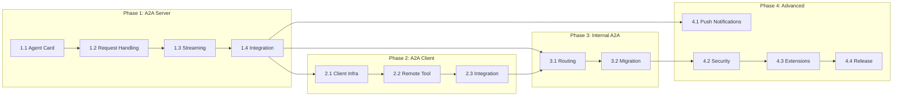

# A2A Integration Implementation Roadmap

## Overview

This document provides a detailed implementation roadmap with specific tasks, dependencies, and acceptance criteria for each phase of the A2A integration.

---

## Phase 1: A2A Server (Expose Thenvoi Agents)

### Duration: 4-6 weeks

### Milestone 1.1: Agent Card Infrastructure (Week 1-2)

#### Tasks

| Task | Description | Effort | Dependencies |
|------|-------------|--------|--------------|
| 1.1.1 | Design Agent Card schema in Elixir | 2d | None |
| 1.1.2 | Create Agent Card Generator module | 3d | 1.1.1 |
| 1.1.3 | Add a2a_* fields to Agent schema | 1d | None |
| 1.1.4 | Create migration for new fields | 0.5d | 1.1.3 |
| 1.1.5 | Implement `/.well-known/agent.json` endpoint | 1d | 1.1.2 |
| 1.1.6 | Add Agent Card caching | 1d | 1.1.5 |
| 1.1.7 | Write unit tests for card generation | 2d | 1.1.2 |

#### Acceptance Criteria

- [ ] GET `/a2a/agents/{id}/.well-known/agent.json` returns valid A2A Agent Card
- [ ] Agent Card includes name, description, skills (from tools), capabilities
- [ ] Agent Card validates against A2A JSON schema
- [ ] Caching reduces database queries by 90%+

### Milestone 1.2: A2A Request Handling (Week 2-3)

#### Tasks

| Task | Description | Effort | Dependencies |
|------|-------------|--------|--------------|
| 1.2.1 | Create A2A Router module | 2d | None |
| 1.2.2 | Implement JSON-RPC request parsing | 2d | 1.2.1 |
| 1.2.3 | Create Message Adapter (A2A → Thenvoi) | 3d | None |
| 1.2.4 | Create Task Adapter (Execution → Task) | 2d | None |
| 1.2.5 | Implement `message/send` endpoint | 3d | 1.2.2, 1.2.3 |
| 1.2.6 | Implement `tasks/get` endpoint | 1d | 1.2.4 |
| 1.2.7 | Add A2A authentication middleware | 2d | 1.2.1 |
| 1.2.8 | Write integration tests | 3d | 1.2.5, 1.2.6 |

#### Acceptance Criteria

- [ ] POST `/a2a/agents/{id}/message/send` creates execution and returns task
- [ ] Blocking mode waits for completion
- [ ] Non-blocking mode returns immediately with task ID
- [ ] GET `/a2a/agents/{id}/tasks/{task_id}` returns task status
- [ ] Authentication required for all A2A endpoints

### Milestone 1.3: Streaming Support (Week 3-4)

#### Tasks

| Task | Description | Effort | Dependencies |
|------|-------------|--------|--------------|
| 1.3.1 | Research SSE in Phoenix | 1d | None |
| 1.3.2 | Implement SSE connection handler | 2d | 1.3.1 |
| 1.3.3 | Create TaskStatusUpdateEvent generator | 2d | 1.2.4 |
| 1.3.4 | Create TaskArtifactUpdateEvent generator | 2d | 1.2.4 |
| 1.3.5 | Implement `message/stream` endpoint | 3d | 1.3.2, 1.3.3 |
| 1.3.6 | Handle connection lifecycle | 1d | 1.3.5 |
| 1.3.7 | Write streaming tests | 2d | 1.3.5 |

#### Acceptance Criteria

- [ ] POST `/a2a/agents/{id}/message/stream` returns SSE connection
- [ ] Status updates sent as events during processing
- [ ] Artifact updates sent as partial results
- [ ] Connection properly closed on completion
- [ ] Handles client disconnection gracefully

### Milestone 1.4: Integration & Polish (Week 4-6)

#### Tasks

| Task | Description | Effort | Dependencies |
|------|-------------|--------|--------------|
| 1.4.1 | Add error handling and mapping | 2d | 1.2.5 |
| 1.4.2 | Implement rate limiting | 1d | 1.2.7 |
| 1.4.3 | Add request/response logging | 1d | 1.2.1 |
| 1.4.4 | Create A2A admin UI toggle | 2d | 1.1.3 |
| 1.4.5 | Write API documentation | 3d | All |
| 1.4.6 | Compatibility testing with A2A SDK | 3d | All |
| 1.4.7 | Performance testing | 2d | All |
| 1.4.8 | Security review | 2d | All |

#### Acceptance Criteria

- [ ] Errors mapped to A2A error format
- [ ] Rate limiting prevents abuse
- [ ] All requests logged for debugging
- [ ] UI allows enabling/disabling A2A per agent
- [ ] Documentation complete and accurate
- [ ] Works with official A2A Python SDK
- [ ] Latency < 500ms for 95th percentile

---

## Phase 2: A2A Client (Connect to External Agents)

### Duration: 3-4 weeks

### Milestone 2.1: Client Infrastructure (Week 1-2)

#### Tasks

| Task | Description | Effort | Dependencies |
|------|-------------|--------|--------------|
| 2.1.1 | Design A2A Client Manager GenServer | 2d | None |
| 2.1.2 | Implement agent discovery (fetch card) | 2d | 2.1.1 |
| 2.1.3 | Create Message Adapter (Thenvoi → A2A) | 2d | None |
| 2.1.4 | Implement HTTP client for A2A requests | 2d | 2.1.1 |
| 2.1.5 | Add connection pooling | 1d | 2.1.4 |
| 2.1.6 | Implement card caching | 1d | 2.1.2 |
| 2.1.7 | Write unit tests | 2d | 2.1.2, 2.1.4 |

#### Acceptance Criteria

- [ ] Can discover and cache external agent cards
- [ ] HTTP client handles timeouts and retries
- [ ] Connection pooling reduces overhead
- [ ] Card cache with configurable TTL

### Milestone 2.2: Remote Agent Tool (Week 2-3)

#### Tasks

| Task | Description | Effort | Dependencies |
|------|-------------|--------|--------------|
| 2.2.1 | Create RemoteA2AAgentService | 3d | 2.1.4 |
| 2.2.2 | Define tool schema (agent_url, task, etc.) | 1d | 2.2.1 |
| 2.2.3 | Integrate with ServiceRegistry | 1d | 2.2.1 |
| 2.2.4 | Handle async task completion | 2d | 2.2.1 |
| 2.2.5 | Add external agent to Agent schema | 1d | None |
| 2.2.6 | Create admin UI for external agents | 2d | 2.2.5 |
| 2.2.7 | Write integration tests | 2d | 2.2.1 |

#### Acceptance Criteria

- [ ] Agents can call external A2A agents via tool
- [ ] Results incorporated into execution
- [ ] Async completion handled correctly
- [ ] UI allows adding external A2A agents

### Milestone 2.3: Integration (Week 3-4)

#### Tasks

| Task | Description | Effort | Dependencies |
|------|-------------|--------|--------------|
| 2.3.1 | Integrate with Executor | 2d | 2.2.1 |
| 2.3.2 | Handle external agent errors | 1d | 2.3.1 |
| 2.3.3 | Add timeout configuration | 1d | 2.3.1 |
| 2.3.4 | Test with A2A SDK samples | 2d | All |
| 2.3.5 | Documentation | 2d | All |
| 2.3.6 | Security review | 1d | All |

#### Acceptance Criteria

- [ ] End-to-end flow works: Thenvoi agent → External A2A agent → Response
- [ ] Errors from external agents handled gracefully
- [ ] Configurable timeouts per agent
- [ ] Works with official A2A samples

---

## Phase 3: Internal A2A Communication

### Duration: 2-3 weeks

### Milestone 3.1: Internal Routing (Week 1-2)

#### Tasks

| Task | Description | Effort | Dependencies |
|------|-------------|--------|--------------|
| 3.1.1 | Design internal A2A routing | 2d | Phase 1, 2 |
| 3.1.2 | Implement local A2A transport | 2d | 3.1.1 |
| 3.1.3 | Optimize for in-process calls | 1d | 3.1.2 |
| 3.1.4 | Update handoff logic to use A2A | 2d | 3.1.2 |
| 3.1.5 | Add feature flag for internal A2A | 1d | 3.1.2 |
| 3.1.6 | Write tests | 2d | 3.1.4 |

#### Acceptance Criteria

- [ ] Agent-to-agent handoffs use A2A protocol
- [ ] Local transport optimized (no HTTP overhead)
- [ ] Feature flag allows gradual rollout
- [ ] No performance regression

### Milestone 3.2: Migration & Polish (Week 2-3)

#### Tasks

| Task | Description | Effort | Dependencies |
|------|-------------|--------|--------------|
| 3.2.1 | Ensure protocol compliance | 2d | 3.1.4 |
| 3.2.2 | Add monitoring/metrics | 1d | 3.1.4 |
| 3.2.3 | Update documentation | 1d | All |
| 3.2.4 | Performance testing | 1d | All |
| 3.2.5 | Gradual rollout | 2d | 3.1.5 |

#### Acceptance Criteria

- [ ] All internal A2A messages protocol-compliant
- [ ] Metrics for A2A request volume/latency
- [ ] Documentation updated
- [ ] Performance equivalent or better than before

---

## Phase 4: Advanced Features

### Duration: 4-6 weeks

### Milestone 4.1: Push Notifications (Week 1-2)

#### Tasks

| Task | Description | Effort | Dependencies |
|------|-------------|--------|--------------|
| 4.1.1 | Design push notification system | 2d | Phase 1 |
| 4.1.2 | Implement webhook delivery | 2d | 4.1.1 |
| 4.1.3 | Add retry logic | 1d | 4.1.2 |
| 4.1.4 | Store callback URLs in execution | 1d | 4.1.1 |
| 4.1.5 | Write tests | 2d | 4.1.2 |

### Milestone 4.2: Security Enhancements (Week 2-3)

#### Tasks

| Task | Description | Effort | Dependencies |
|------|-------------|--------|--------------|
| 4.2.1 | Implement Agent Card signing | 3d | None |
| 4.2.2 | Create Extended Agent Cards | 2d | 4.2.1 |
| 4.2.3 | Add OAuth 2.0 support | 3d | None |
| 4.2.4 | Security testing | 2d | All |

### Milestone 4.3: Protocol Extensions (Week 3-4)

#### Tasks

| Task | Description | Effort | Dependencies |
|------|-------------|--------|--------------|
| 4.3.1 | Research gRPC binding | 2d | None |
| 4.3.2 | Implement gRPC server (optional) | 5d | 4.3.1 |
| 4.3.3 | Agent registry integration | 3d | Phase 1 |
| 4.3.4 | Documentation | 2d | All |

### Milestone 4.4: Release (Week 5-6)

#### Tasks

| Task | Description | Effort | Dependencies |
|------|-------------|--------|--------------|
| 4.4.1 | Full system testing | 3d | All |
| 4.4.2 | Performance optimization | 2d | 4.4.1 |
| 4.4.3 | Documentation finalization | 2d | All |
| 4.4.4 | Release preparation | 2d | All |

---

## Dependency Graph

---

## Risk Register

| Risk | Phase | Probability | Impact | Mitigation |
|------|-------|-------------|--------|------------|
| A2A spec changes | All | Medium | High | Abstract layer, version support |
| Performance issues | 1, 3 | Low | Medium | Early benchmarking, caching |
| Security vulnerabilities | All | Medium | High | Security review each phase |
| Scope creep | All | High | Medium | Strict phase boundaries |
| Integration complexity | 2, 3 | Medium | Medium | Prototype first |

---

## Key Milestones Summary

| Milestone | Target Date | Key Deliverable |
|-----------|-------------|-----------------|
| Phase 1 Complete | Week 6 | External A2A clients can call Thenvoi agents |
| Phase 2 Complete | Week 10 | Thenvoi agents can call external A2A agents |
| Phase 3 Complete | Week 13 | Internal communication uses A2A |
| Phase 4 Complete | Week 19 | Full A2A ecosystem participation |

---

## Team Requirements

### Phase 1-2
- 2 Backend Engineers (Elixir)
- 0.5 Frontend Engineer (LiveView)
- 1 QA Engineer

### Phase 3-4
- 1.5 Backend Engineers
- 0.5 Frontend Engineer
- 0.5 QA Engineer

### Throughout
- Technical Lead (oversight)
- Product Manager (prioritization)
- Security Engineer (reviews)
