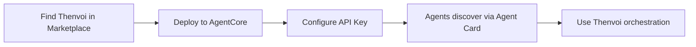

# PRD: Thenvoi A2A Server for AWS Bedrock AgentCore

---

**Status:** Draft
**Author:** Product
**Date:** 2026-01-10
**Research:** See [agentcore-thenvoi-integration](https://github.com/thenvoi/research_files/tree/main/agentcore-thenvoi-integration) for full research

---

## TL;DR

Build a Docker container (`thenvoi-agentcore-a2a`) that runs on AWS Bedrock AgentCore Runtime, exposing Thenvoi's orchestration capabilities via the A2A protocol. This enables any agent running on AgentCore to discover and use Thenvoi for multi-agent orchestration, human-in-the-loop, and cross-framework collaboration.

---

## What This PRD Is NOT

There are **three possible integration paths** between Thenvoi and AgentCore. This PRD covers only the first:

| Integration Path | What It Does | Status |
|------------------|--------------|--------|
| **A2A Server** (this PRD) | Thenvoi as a discoverable agent on AgentCore | **In Scope** |
| MCP via Gateway | Thenvoi as tools (create_session, send_message) | Future PRD |
| SDK Adapter | Python library for native AgentCore/Strands integration | Future PRD |

### Why Start with A2A?

**A2A provides the highest value with the broadest coverage:**

1. **Full bi-directional communication** - Unlike MCP (request-response only), A2A supports streaming and push notifications. Thenvoi can proactively send messages to agents, enabling real-time orchestration.

2. **Agent discovery** - Any agent on AgentCore can discover Thenvoi via the standard Agent Card mechanism (`/.well-known/agent-card.json`). No code changes required in consuming agents.

3. **Covers most use cases** - Multi-agent orchestration, human-in-the-loop, session management - all work through A2A. MCP would only add convenience for simple tool calls.

4. **Marketplace ready** - A2A Servers can be listed on AWS Bedrock Marketplace, enabling distribution to all AgentCore users.

5. **MVP with clear value** - A2A Server is self-contained. It requires no changes to the Thenvoi Platform and minimal dependencies.

### What the Other Paths Add (Future)

| Path | Adds | When to Consider |
|------|------|------------------|
| **MCP via Gateway** | Simpler tool-based integration for agents that don't need full orchestration | After A2A is validated with users |
| **SDK Adapter** | Native Python integration for developers who want code-level control | When Python developers request it |

---

## 1. Problem Statement

### WHO: Target Users

**Two personas:**

1. **AgentCore Users** - Developers running agents on AWS Bedrock AgentCore who need:
   - Multi-agent coordination without building it themselves
   - Human approval workflows for high-stakes decisions
   - Real-time visibility into agent conversations
   - Cross-framework collaboration (LangGraph + CrewAI + custom)

2. **Thenvoi Users** - Developers using Thenvoi who want:
   - To run their orchestrated agents on enterprise-grade AWS infrastructure
   - Serverless scaling via AgentCore Runtime
   - Access to AgentCore services (Memory, Identity, Browser, Code Interpreter)

### WHY: The Gap

AgentCore provides excellent infrastructure for running agents but lacks:

| Capability | AgentCore Today | With Thenvoi |
|------------|-----------------|--------------|
| Multi-agent patterns | Build yourself | Built-in (supervisor, collaborative, hierarchical) |
| Human-in-the-loop | Not supported | Native human participants in sessions |
| Real-time conversation UI | CloudWatch logs only | LiveView streaming UI |
| Cross-framework orchestration | Basic A2A | Full orchestration layer |
| Session management | Memory service (context only) | Full chat system with history |

### WHY NOW

- AgentCore GA: October 2025 (< 1 year old)
- 2M+ SDK downloads, ecosystem actively building
- First-mover advantage in orchestration layer
- Bedrock Marketplace listing opportunity

---

## 2. Solution Overview

### What We're Building

A Docker container (`thenvoi-agentcore-a2a`) that:

1. Runs on AgentCore Runtime as an A2A Server
2. Exposes Thenvoi capabilities via A2A protocol
3. Connects to Thenvoi Platform via REST + WebSocket
4. Enables any AgentCore agent to discover and use Thenvoi

### Architecture

```
AgentCore Runtime
┌────────────────────────────────────────────────────────────┐
│                                                            │
│  ┌──────────────┐                   ┌──────────────┐      │
│  │   Agent 1    │                   │   Agent 2    │      │
│  │  (LangGraph) │                   │   (CrewAI)   │      │
│  └──────┬───────┘                   └───────▲──────┘      │
│         │                                   │              │
│         │ 1. A2A request                    │ 4. A2A call  │
│         ▼                                   │              │
│  ┌──────────────────────────────────────────┴───────────┐ │
│  │              thenvoi-agentcore-a2a                    │ │
│  │              (Adapter Container)                      │ │
│  │                                                       │ │
│  │  Endpoints:                                           │ │
│  │  - GET /ping (health check)                          │ │
│  │  - GET /.well-known/agent-card.json (discovery)      │ │
│  │  - POST / (JSON-RPC message handling)                │ │
│  │                                                       │ │
│  │  Port: 9000                                          │ │
│  └───────────────────────┬───────────────────────────────┘ │
│                          │                                  │
└──────────────────────────┼──────────────────────────────────┘
                           │ 2. REST + WebSocket
                           ▼
              ┌─────────────────────────┐
              │    Thenvoi Platform     │
              │                         │
              │  • Session management   │
              │  • Orchestration logic  │
              │  • Human-in-the-loop    │
              │  • History & context    │
              │  • LiveView UI          │
              └────────────┬────────────┘
                           │
                           │ 3. Orchestration decision
                           ▼
              (Response flows back up)
```

### Data Flow Example

1. **Agent 1** sends A2A message: "Coordinate with Agent 2 to analyze this data"
2. **thenvoi-agentcore-a2a** receives, forwards to Thenvoi Platform
3. **Thenvoi Platform** creates session, determines Agent 2 should handle part of task
4. **thenvoi-agentcore-a2a** calls Agent 2 via A2A protocol
5. Responses aggregate through Platform back to Agent 1

---

## 3. Technical Requirements

### 3.1 Container Specifications

| Requirement | Specification |
|-------------|---------------|
| Architecture | ARM64 (AWS Graviton) |
| Port | 9000 |
| Design | Stateless |
| Health Check | `GET /ping` → `{"status": "Healthy"}` |
| Base Image | Python 3.11+ slim |

### 3.2 Container Endpoints (A2A Protocol)

These are the endpoints exposed by the `thenvoi-agentcore-a2a` container. Other agents on AgentCore call these endpoints to interact with Thenvoi.

> **Note:** These are NOT Thenvoi Platform API endpoints. The container translates A2A protocol calls into Thenvoi Platform REST/WebSocket calls internally.

#### `GET /ping`

Health check for AgentCore.

**Response:**
```json
{"status": "Healthy"}
```

#### `GET /.well-known/agent-card.json`

Agent discovery card.

**Response:**
```json
{
  "name": "Thenvoi Orchestration Agent",
  "description": "Multi-agent orchestration with human-in-the-loop capabilities",
  "url": "https://runtime.agentcore.aws/...",
  "version": "1.0.0",
  "protocolVersion": "0.3",
  "capabilities": {
    "streaming": true,
    "pushNotifications": true
  },
  "skills": [
    {
      "id": "orchestrate",
      "name": "Orchestrate Agents",
      "description": "Coordinate multiple agents on a complex task with built-in patterns (supervisor, collaborative, hierarchical)"
    },
    {
      "id": "human_loop",
      "name": "Human in the Loop",
      "description": "Request human approval or input during agent workflows"
    },
    {
      "id": "create_session",
      "name": "Create Session",
      "description": "Create a new multi-agent collaboration session"
    }
  ],
  "securitySchemes": {
    "apiKey": {
      "type": "apiKey",
      "in": "header",
      "name": "X-Thenvoi-API-Key"
    }
  }
}
```

#### `POST /` (JSON-RPC)

Message handling endpoint.

**Request:**
```json
{
  "jsonrpc": "2.0",
  "id": "req-001",
  "method": "message/send",
  "params": {
    "message": {
      "role": "user",
      "parts": [{"kind": "text", "text": "Orchestrate analysis task with agents X and Y"}],
      "messageId": "msg-123"
    }
  }
}
```

**Response:**
```json
{
  "jsonrpc": "2.0",
  "id": "req-001",
  "result": {
    "artifacts": [
      {
        "parts": [{"kind": "text", "text": "Session created. Coordinating agents..."}]
      }
    ]
  }
}
```

### 3.3 Authentication

**Two layers:**

| Connection | Auth Method | Details |
|------------|-------------|---------|
| Agent → Container | AgentCore handles | SigV4/OAuth within AgentCore network |
| Container → Thenvoi Platform | Thenvoi API Key | `Authorization: Bearer thnv_xxxx` |

**Environment Variables:**
```
THENVOI_API_KEY=thnv_xxxx      # Required: Thenvoi API key
THENVOI_BASE_URL=https://api.thenvoi.com  # Optional: defaults to production
```

### 3.4 Project Structure

```
thenvoi-agentcore-a2a/
├── Dockerfile
├── src/
│   ├── server.py           # FastAPI server (port 9000)
│   ├── a2a_handler.py      # JSON-RPC message handling
│   ├── agent_card.py       # Agent Card generation
│   └── thenvoi_client.py   # Thenvoi Platform REST + WebSocket client
├── tests/
│   ├── test_endpoints.py
│   └── test_integration.py
├── requirements.txt
└── agentcore.yaml          # AgentCore deployment config
```

### 3.5 Dockerfile

```dockerfile
FROM python:3.11-slim

WORKDIR /app

COPY requirements.txt .
RUN pip install --no-cache-dir -r requirements.txt

COPY src/ .

EXPOSE 9000

HEALTHCHECK --interval=30s --timeout=3s \
  CMD curl -f http://localhost:9000/ping || exit 1

CMD ["uvicorn", "server:app", "--host", "0.0.0.0", "--port", "9000"]
```

**Build command:**
```bash
docker buildx build --platform linux/arm64 -t thenvoi-agentcore-a2a .
```

---

## 4. User Experience

### 4.1 AgentCore User Journey



**Steps:**

1. User finds "Thenvoi Orchestration" in Bedrock Marketplace
2. Clicks "Deploy" → AWS runs container in user's account
3. Configures `THENVOI_API_KEY` environment variable
4. User's agents can now discover and use Thenvoi

### 4.2 Developer Integration

**Minimal code change for existing agents:**

```python
# Discover Thenvoi
thenvoi = discover_agent("Thenvoi Orchestration")

# Use orchestration
response = thenvoi.send({
    "method": "message/send",
    "params": {
        "message": {
            "role": "user",
            "parts": [{"kind": "text", "text": "Coordinate agents A and B on task X"}]
        }
    }
})
```

---

## 5. Scope

### In Scope

- Docker container with A2A protocol support
- Agent Card generation
- Connection to Thenvoi Platform (REST + WebSocket)
- Health check endpoint
- JSON-RPC message handling
- Basic error handling and logging
- ARM64 build for AgentCore

### Out of Scope (Future Phases)

- MCP Server via Gateway (separate PRD)
- Python SDK AgentCore Adapter (separate PRD)
- Bedrock Marketplace listing (Phase 2 of this work)
- AgentCore Memory service integration
- AgentCore Identity integration
- VPC/PrivateLink support

---

## 6. Dependencies

### Thenvoi Platform

| Dependency | Status | Notes |
|------------|--------|-------|
| REST API | Ready | Existing endpoints sufficient |
| WebSocket | Ready | For real-time updates from Platform |
| API Key auth | Ready | Standard `Authorization: Bearer` |

**No Thenvoi Platform changes required.**

### External

| Dependency | Notes |
|------------|-------|
| AWS Account | With AgentCore access |
| ECR Repository | For container storage |
| AgentCore CLI | For testing and deployment |

---

## 7. Risks & Mitigations

| Risk | Likelihood | Impact | Mitigation |
|------|------------|--------|------------|
| AgentCore API changes | Low | High | Abstract integration layer, monitor AWS updates |
| A2A protocol version changes | Low | Medium | Support multiple protocol versions |
| WebSocket connection stability | Medium | Medium | Implement reconnection logic, connection pooling |
| Container cold start latency | Medium | Low | Optimize container size, use keep-alive |

---

## 8. Open Questions

1. **Pricing model for Marketplace listing** - Usage-based, subscription, or hybrid?
2. **Container image versioning** - How to handle updates pushed to existing deployments?
3. **Multi-region support** - Deploy to all AgentCore regions or start with one?
4. **Thenvoi account provisioning** - Self-service signup or sales-assisted for enterprise?

---

## 9. Success Criteria

### Functional

- [ ] Container runs successfully on AgentCore Runtime
- [ ] Agent Card is discoverable by other agents
- [ ] End-to-end message flow: Agent → Container → Platform → Response
- [ ] Human-in-the-loop workflow functions correctly
- [ ] Streaming responses work via A2A

### Non-Functional

- [ ] Health check responds < 100ms
- [ ] Container startup < 30 seconds
- [ ] No memory leaks over 8-hour session

---

## 10. Implementation Phases

### Phase 1: Core Container

**Deliverables:**
- [ ] FastAPI server with 3 endpoints
- [ ] Thenvoi Platform client (REST + WebSocket)
- [ ] Agent Card generation
- [ ] Local testing with Docker
- [ ] Basic logging and error handling

### Phase 2: AgentCore Integration

**Deliverables:**
- [ ] ARM64 build verified
- [ ] ECR repository setup
- [ ] AgentCore deployment tested
- [ ] End-to-end flow verified with test agents

### Phase 3: Production Readiness

**Deliverables:**
- [ ] Comprehensive error handling
- [ ] Reconnection logic for WebSocket
- [ ] Observability (structured logging, metrics)
- [ ] Documentation (setup guide, API reference)

### Phase 4: Marketplace (Future)

**Deliverables:**
- [ ] AWS Marketplace seller registration
- [ ] FTR (Foundational Technical Review)
- [ ] Listing content and pricing
- [ ] Launch

---

## Appendix A: Related Documents

- [00-executive-summary.md](./00-executive-summary.md) - Research overview
- [01-agentcore-deep-dive.md](./01-agentcore-deep-dive.md) - AgentCore capabilities
- [02-user-value-analysis.md](./02-user-value-analysis.md) - User value proposition
- [03-integration-paths.md](./03-integration-paths.md) - Technical integration options
- [04-marketplace-listing.md](./04-marketplace-listing.md) - Marketplace guide
- [05-competitive-landscape.md](./05-competitive-landscape.md) - Competition analysis
- [06-implementation-roadmap.md](./06-implementation-roadmap.md) - Full roadmap

## Appendix B: A2A Protocol Reference

- [A2A GitHub](https://github.com/a2aproject/A2A)
- [A2A in AgentCore](https://aws.amazon.com/blogs/machine-learning/introducing-agent-to-agent-protocol-support-in-amazon-bedrock-agentcore-runtime/)

## Appendix C: AgentCore Documentation

- [AgentCore Overview](https://aws.amazon.com/bedrock/agentcore/)
- [AgentCore Runtime](https://docs.aws.amazon.com/bedrock-agentcore/latest/devguide/runtime.html)
- [AgentCore Marketplace](https://docs.aws.amazon.com/marketplace/latest/userguide/bedrock-agentcore-runtime.html)
