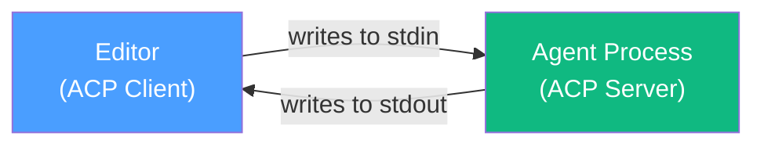
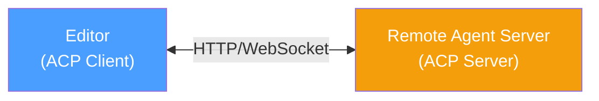
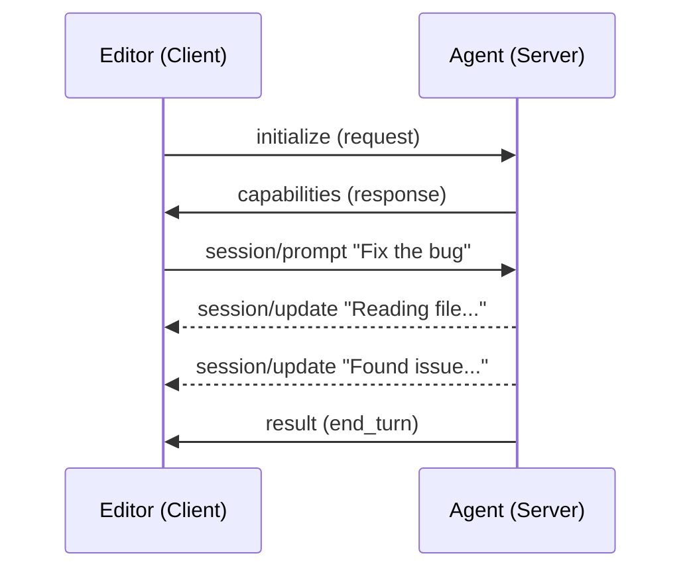

# ACP Architecture Analysis

**Status:** Complete
**Last Updated:** 2026-01-06

## Summary

The Agent Client Protocol (ACP) is an open standard that standardizes communication between code editors and AI coding agents. Created by Zed and grown by a community of editors and agents, ACP uses JSON-RPC over stdio for local agents and is designed to be the "LSP for AI agents." The protocol emphasizes process-level isolation, session-based interactions, and reuses MCP (Model Context Protocol) concepts where applicable.

## Key Findings

### 1. Protocol Design Philosophy

ACP follows the Language Server Protocol (LSP) model of decoupling:

> "Just as the Language Server Protocol unbundled language intelligence from monolithic IDEs, our goal with the Agent Client Protocol is to enable you to switch between multiple agents without switching your editor." - [Zed ACP](https://zed.dev/acp)

**Core Design Principles:**
- **User-centric**: User is in their editor, reaching out to agents
- **Process isolation**: Strong security boundaries through subprocess model
- **Editor-agnostic**: Any editor can implement ACP client
- **Agent-agnostic**: Any agent can implement ACP server

**Confidence:** High (official documentation)

### 2. Transport & Communication

| Aspect               | Specification                   |
| -------------------- | ------------------------------- |
| **Protocol**         | JSON-RPC 2.0                    |
| **Local Transport**  | stdio (stdin/stdout)            |
| **Remote Transport** | HTTP/WebSocket (in development) |
| **Message Format**   | JSON                            |
| **Text Format**      | Markdown                        |

#### Communication Models

**Local Agent Model:**



**Remote Agent Model (Draft):**



> **Note:** Full support for remote agents is a work in progress. The ACP team is actively collaborating with agentic platforms to ensure the protocol addresses the specific requirements of cloud-hosted and remote deployment scenarios.

#### JSON-RPC Message Structure

ACP uses standard JSON-RPC 2.0 message format:

**Request (Client → Agent):**
```json
{
  "jsonrpc": "2.0",
  "id": "req-123",
  "method": "session/prompt",
  "params": { "prompt": "Fix the bug in auth.ts" }
}
```

**Response (Agent → Client):**
```json
{
  "jsonrpc": "2.0",
  "id": "req-123",
  "result": { "stop_reason": "end_turn" }
}
```

**Notification (no response expected):**
```json
{
  "jsonrpc": "2.0",
  "method": "session/update",
  "params": { "content": "Looking at the code..." }
}
```

**Error Response:**
```json
{
  "jsonrpc": "2.0",
  "id": "req-123",
  "error": {
    "code": -32600,
    "message": "Invalid request",
    "data": { "details": "..." }
  }
}
```

#### Example Communication Flow



**Confidence:** High (protocol specification)

### 3. Core Protocol Methods

Based on the [ACP Schema](https://github.com/agentclientprotocol/agent-client-protocol/blob/main/schema/schema.json):

#### Initialization & Authentication
| Method | Direction | Purpose |
|--------|-----------|---------|
| `initialize` | Client → Agent | Establish connection, negotiate capabilities |
| `authenticate` | Client → Agent | Authenticate using specified method |

#### Session Management
| Method | Direction | Purpose |
|--------|-----------|---------|
| `session/new` | Client → Agent | Create new conversation session |
| `session/load` | Client → Agent | Restore existing session |
| `session/prompt` | Client → Agent | Send user prompt, handle full lifecycle |
| `session/cancel` | Client → Agent | Cancel ongoing operations |
| `session/update` | Agent → Client | Stream real-time progress (notification) |

#### File System Operations
| Method | Direction | Purpose |
|--------|-----------|---------|
| `fs/read_text_file` | Agent → Client | Read file contents |
| `fs/write_text_file` | Agent → Client | Write file contents |

#### Terminal Operations
| Method | Direction | Purpose |
|--------|-----------|---------|
| `terminal/create` | Agent → Client | Execute commands |
| `terminal/output` | Agent → Client | Get command output |
| `terminal/wait_for_exit` | Agent → Client | Wait for completion |
| `terminal/kill` | Agent → Client | Terminate command |
| `terminal/release` | Agent → Client | Release terminal resources |

#### Permission & Mode Management
| Method | Direction | Purpose |
|--------|-----------|---------|
| `session/request_permission` | Agent → Client | Request user authorization |
| `session/set_mode` | Agent → Client | Switch operating modes |

**Confidence:** High (schema analysis)

### 4. Capability Negotiation

ACP uses capability negotiation during initialization:

**Agent Capabilities** (advertised by agent):
- MCP support (tool integration)
- Prompt handling (audio, images, embedded context)
- Session loading support

**Client Capabilities** (advertised by editor):
- File system operations
- Terminal support
- Specific UI features

**Session Capabilities:**
- Baseline: `session/new`, `session/prompt`, `session/cancel`
- Optional extensions based on negotiation

**Confidence:** High (specification)

### 5. Extension Mechanisms

ACP provides extensibility through:

| Mechanism | Purpose |
|-----------|---------|
| `ExtRequest`/`ExtResponse` | Custom methods outside ACP spec |
| `ExtNotification` | One-way custom messages |
| `x-` prefix | Custom capability/type names |
| `metadata` fields | Agent-specific data |

This allows agents to add custom functionality while remaining ACP-compliant.

**Confidence:** High (specification)

### 6. Current Ecosystem Support

**ACP Clients (Editors):**

| Client | Status | Notes |
|--------|--------|-------|
| Zed | Native | Reference implementation |
| Neovim | Plugins | CodeCompanion, avante.nvim |
| Emacs | Plugin | agent-shell |
| marimo | Native | Python notebook |
| JetBrains | Coming Soon | Partnership announced |
| Eclipse | Prototype | In development |
| VS Code | Symposium | Via extension |

**ACP Agents:**

| Agent | Status | Notes |
|-------|--------|-------|
| Gemini CLI | Native | Reference implementation |
| Claude Code | Adapter | Via Zed SDK adapter |
| Codex CLI | Adapter | Via Zed adapter |
| Goose | Native | Square's open-source agent |
| OpenCode | Native | SST implementation |
| Docker cagent | Native | Container-focused |
| 10+ others | Various | See [agents list](https://agentclientprotocol.com/overview/agents) |

**Confidence:** High (official documentation)

### 7. SDK Availability

Official SDKs maintained by ACP organization:

| Language | Package | Repository |
|----------|---------|------------|
| TypeScript | `@agentclientprotocol/sdk` | [typescript-sdk](https://github.com/agentclientprotocol/typescript-sdk) |
| Python | `acp-sdk` | [python-sdk](https://github.com/agentclientprotocol/python-sdk) |
| Rust | `agent-client-protocol` | [rust-sdk](https://github.com/agentclientprotocol/rust-sdk) |
| Kotlin | `acp-kotlin` | [kotlin-sdk](https://github.com/agentclientprotocol/kotlin-sdk) |

**Confidence:** High (GitHub repositories)

### 8. Active RFDs (Protocol Evolution)

The protocol is actively evolving through RFDs (Requests for Dialog).

**RFD Index:** [agentclientprotocol.com/rfds](https://agentclientprotocol.com/rfds)

| RFD                           | Status | Relevance to Thenvoi                | Links                                                                                                                                          |
| ----------------------------- | ------ | ----------------------------------- | ---------------------------------------------------------------------------------------------------------------------------------------------- |
| Proxy Chains                  | Draft  | **High** - Multi-agent architecture | [Docs](https://agentclientprotocol.com/rfds/proxy-chains)                                                                                      |
| Agent Registry                | Draft  | **High** - Agent discovery          | [Docs](https://agentclientprotocol.com/rfds/acp-agent-registry)                                                                                |
| Authentication                | Draft  | Medium - Enterprise features        | [Docs](https://agentclientprotocol.com/rfds/authentication) / [PR #330](https://github.com/agentclientprotocol/agent-client-protocol/pull/330) |
| Session List                  | Draft  | Medium - State handling             | [Docs](https://agentclientprotocol.com/rfds/session-list)                                                                                      |
| Session Config Options        | Draft  | Medium - State handling             | [Docs](https://agentclientprotocol.com/rfds/session-config-options)                                                                            |
| Session Fork                  | Draft  | Medium - State handling             | [Docs](https://agentclientprotocol.com/rfds/session-fork)                                                                                      |
| Session Resume                | Draft  | Medium - State handling             | [Docs](https://agentclientprotocol.com/rfds/session-resume)                                                                                    |
| Request Cancellation          | Draft  | Medium - UX                         | [Docs](https://agentclientprotocol.com/rfds/request-cancellation)                                                                              |
| Next Edit Suggestions         | Draft  | Low - IDE feature                   | [PR #325](https://github.com/agentclientprotocol/agent-client-protocol/pull/325)                                                               |
| Agent-guided Selection        | Draft  | Medium - UX patterns                | [PR #340](https://github.com/agentclientprotocol/agent-client-protocol/pull/340)                                                               |
| Symposium (Multi-agent Proxy) | Draft  | **High** - Multi-agent              | [PR #359](https://github.com/agentclientprotocol/agent-client-protocol/pull/359)                                                               |
| Message ID                    | Draft  | Low - Protocol feature              | [PR #244](https://github.com/agentclientprotocol/agent-client-protocol/pull/244)                                                               |
| Telemetry Export              | Draft  | Low - Observability                 | [Docs](https://agentclientprotocol.com/rfds/agent-telemetry-export)                                                                            |

**Completed RFDs:**

| RFD | Links |
|-----|-------|
| Introduce RFD Process | [Docs](https://agentclientprotocol.com/rfds/introduce-rfd-process) |

**Confidence:** High (GitHub RFD tracking)

## Community Signals

### Adoption Momentum

- **Zed** driving adoption through native support
- **JetBrains** partnership signals enterprise interest
- **Google** initiated project (Gemini team wanted Zed integration)
- **Docker** building multi-agent runtime on ACP
- **138+ reactions** on Codex ACP support request

### Developer Sentiment

Positive signals:
- Fast adoption across editor ecosystems (Neovim, Emacs, marimo)
- Multiple agents implementing support
- Active community contributions (RFDs, adapters)

Concerns raised:
- Missing multi-agent support
- Configuration not standardized (Goose discussion)
- Remote agent support still in development

## Gaps Identified

### Protocol Gaps

1. **Multi-agent orchestration** - No native support (see [03-multi-agent-gap.md](./03-multi-agent-gap.md))
2. **Remote agents** - Still in development, HTTP/WebSocket transport incomplete
3. **Agent discovery** - Registry RFD is draft status
4. **Configuration** - No standardized config management
5. **Telemetry** - Export RFD is draft

### Ecosystem Gaps

1. **Adapters required** - Major agents (Claude Code, Codex) need adapters
2. **VS Code support** - No native support, only via extensions
3. **Web-based editors** - No clear path for browser-based IDEs
4. **Enterprise features** - Authentication, audit, compliance still developing

## Implications for Thenvoi

### Architectural Fit

Thenvoi's architecture aligns well with ACP:

| Thenvoi Component | ACP Mapping |
|-------------------|-------------|
| Agent | ACP Agent (potential server) |
| AgentExecution | ACP Session |
| ChatMessage | ACP Prompt/Response |
| Tools | MCP Tools (ACP-compatible) |

### Integration Patterns

1. **Thenvoi as ACP Agent** - Expose platform as single ACP-compliant agent
2. **ACP Client in Platform** - Allow Thenvoi to call ACP agents
3. **Orchestration Layer** - Sit between ACP clients and multiple backends
4. **Protocol Bridge** - Connect ACP clients to A2A agent networks

### SDK Considerations

- TypeScript SDK aligns with n8n-nodes-thenvoi
- Python SDK aligns with thenvoi-sdk-python
- Could contribute adapters back to community

## Sources Consulted

- [ACP Official Site](https://zed.dev/acp) - Marketing and overview
- [ACP Introduction](https://agentclientprotocol.com/overview/introduction) - Technical overview
- [ACP Schema](https://github.com/agentclientprotocol/agent-client-protocol/blob/main/schema/schema.json) - Protocol definition
- [ACP GitHub](https://github.com/agentclientprotocol/agent-client-protocol) - Repository and RFDs
- [ACP Agents List](https://agentclientprotocol.com/overview/agents) - Supported agents
- [ACP Clients List](https://agentclientprotocol.com/overview/clients) - Supported editors
- [Zed Blog: ACP Progress](https://zed.dev/blog/acp-progress-report) - Community updates
- [Zed Blog: BYOA](https://zed.dev/blog/bring-your-own-agent-to-zed) - Agent integration

## Related Research Files

- [02-acp-mcp-integration.md](./02-acp-mcp-integration.md) - How ACP and MCP work together
- [03-multi-agent-gap.md](./03-multi-agent-gap.md) - Multi-agent limitations
- [04-custom-agent-integration.md](./04-custom-agent-integration.md) - Building ACP agents
