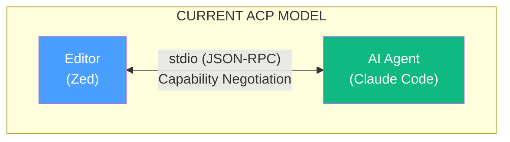
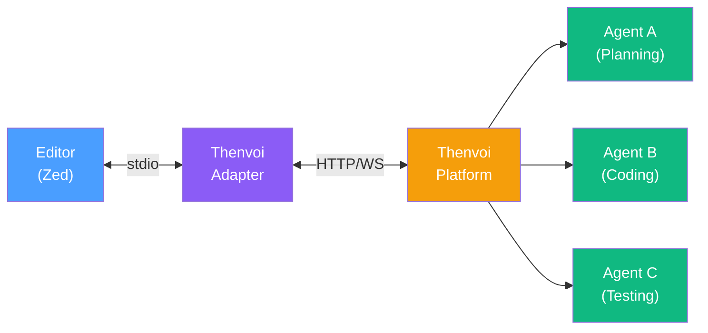

# Thenvoi × ACP Integration Roadmap

**Purpose:** Decision-ready document identifying the safest, highest-impact integration path for Thenvoi with the Agent Client Protocol (ACP).

**Last Updated:** 2026-01-06

---

## ACP Architecture at a Glance

**Current ACP Model:**



> **Key Limitation:** ONE agent per session

**Thenvoi Opportunity:**



> **Key Value:** Multi-agent orchestration through single ACP interface

### Protocol Stack

| Layer | Protocol | Transport | Thenvoi Status |
|-------|----------|-----------|----------------|
| Editor ↔ Agent | ACP | stdio (local) | **Needs Adapter** |
| Agent ↔ Tools | MCP | stdio/HTTP | Already Supported |
| Agent ↔ Agent | None (gap) | - | **Thenvoi's Opportunity** |
| Remote Agents | ACP (draft) | HTTP/WebSocket | Aligned |

---

## Evidence for the Need

### Primary Source: Community Demand

| Signal | Evidence | Link |
|--------|----------|------|
| Multi-agent request | 26+ reactions on Zed discussion | [#37791](https://github.com/zed-industries/zed/discussions/37791) |
| Symposium RFC | Community-driven multi-agent proxy | [PR #359](https://github.com/agentclientprotocol/agent-client-protocol/pull/359) |
| Codex ACP support | 138+ reactions requesting support | [Issue #2785](https://github.com/openai/codex/issues/2785) |
| Docker cagent | Docker built cagent to address multi-agent orchestration gaps in ACP | [docker/cagent](https://github.com/docker/cagent) |

### Secondary Source: Protocol Gaps

From ACP documentation and RFD analysis:

1. **No agent-to-agent communication** - ACP is editor-centric only
2. **Single session = single agent** - Architectural limitation
3. **Remote agents still draft** - HTTP/WebSocket support incomplete
4. **No orchestration layer** - Each agent operates independently

### Tertiary Source: Ecosystem Momentum

| Partner | Action | Significance |
|---------|--------|--------------|
| JetBrains | Partnership announced | Enterprise IDE adoption |
| Google | Gemini CLI native ACP | Reference implementation |
| Docker | Building cagent on ACP | Container-based agents |

---

## Recommended Integration Path

### ACP Super-Agent

**What:** Thenvoi appears to editors as a single ACP-compliant agent, internally orchestrating multiple specialized agents.

**Risk Level:** Low
**Time to MVP:** TBD
**SDK Required:** Python `agent-client-protocol`


**Why Safest:**
- Uses stable ACP primitives (session/prompt, session/update)
- No protocol extensions required
- Works with existing editors today (Zed, Neovim)
- Falls back gracefully if Thenvoi unavailable

**Implementation:**

```python
# Core adapter (simplified)
from acp.server import Server, Session

class ThenvoiACPAdapter(Server):
    async def handle_prompt(self, session: Session, prompt: str):
        # 1. Forward to Thenvoi HTTP API
        response = await self.thenvoi_client.create_execution(
            prompt=prompt,
            context=session.context
        )

        # 2. Stream updates back via ACP
        async for update in response.stream():
            await session.send_update(update.content)

        return response.final_result
```

**Success Criteria:**
- [ ] Zed can discover and launch Thenvoi adapter
- [ ] User prompts route through Thenvoi orchestration
- [ ] Multiple agents collaborate on single request
- [ ] Editor displays streamed progress

---

## What NOT to Build (Yet)

| Approach | Why Defer |
|----------|-----------|
| Custom ACP Extensions | Protocol still evolving; extensions may conflict with RFDs |
| Remote Agent Server | HTTP/WebSocket transport not finalized in ACP spec |
| Agent Registry | Wait for [Agent Registry RFD](https://agentclientprotocol.com/rfds/acp-agent-registry) to stabilize |
| Protocol Bridge (ACP↔A2A) | A2A adoption unclear; focus on ACP first |

---

## Key Sources Referenced

### Official Documentation
- [ACP Introduction](https://agentclientprotocol.com/overview/introduction)
- [ACP Schema (JSON)](https://github.com/agentclientprotocol/agent-client-protocol/blob/main/schema/schema.json)
- [Zed ACP Announcement](https://zed.dev/acp)

### RFDs (Protocol Evolution)
- [Proxy Chains](https://agentclientprotocol.com/rfds/proxy-chains) - Multi-agent patterns
- [Symposium PR #359](https://github.com/agentclientprotocol/agent-client-protocol/pull/359) - Community multi-agent proposal
- [Agent Registry](https://agentclientprotocol.com/rfds/acp-agent-registry) - Discovery mechanism

### SDKs
- [Python SDK](https://github.com/agentclientprotocol/python-sdk) - Server implementation
- [TypeScript SDK](https://github.com/agentclientprotocol/typescript-sdk) - Client implementation

### Community Signals
- [Zed Discussion #37791](https://github.com/zed-industries/zed/discussions/37791) - Multi-agent demand
- [Codex Issue #2785](https://github.com/openai/codex/issues/2785) - ACP support request

---

## Related Research

| Document | Purpose |
|----------|---------|
| [executive-summary.md](./executive-summary.md) | High-level findings and recommendations |
| [01-acp-architecture.md](./01-acp-architecture.md) | Full protocol analysis |
| [03-multi-agent-gap.md](./03-multi-agent-gap.md) | Detailed gap analysis |
| [05-thenvoi-as-acp-agent.md](./05-thenvoi-as-acp-agent.md) | Implementation details |
